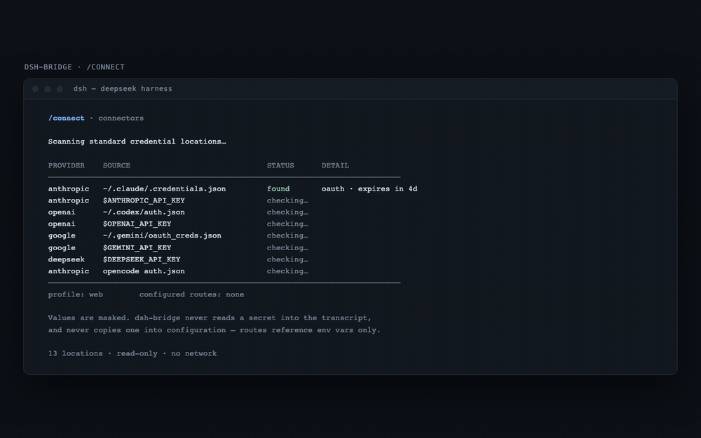
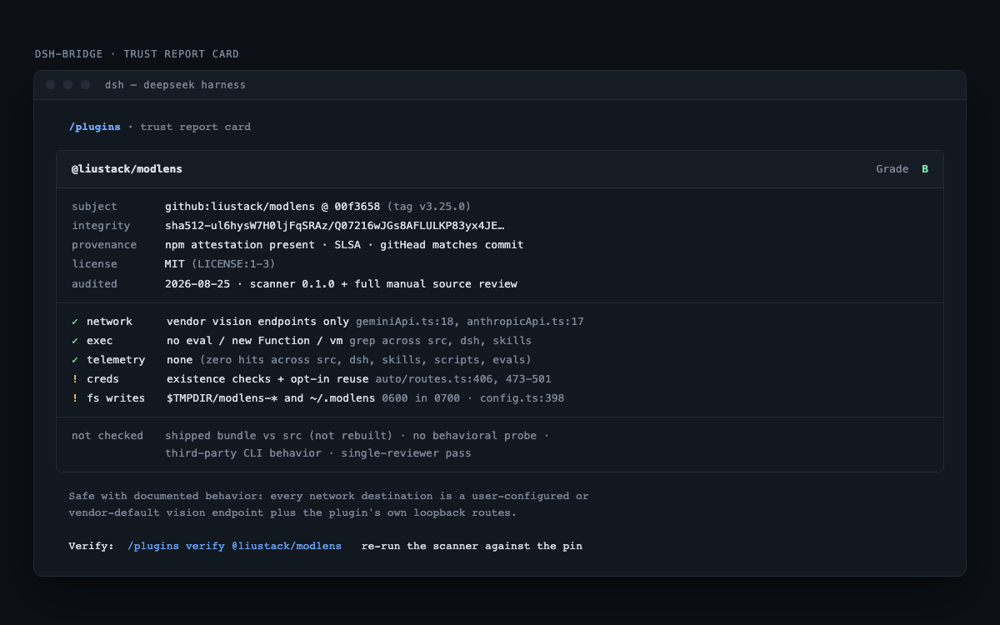

```
██████╗ ███████╗██╗  ██╗  ██████╗ ██████╗ ██╗██████╗  ██████╗ ███████╗
██╔══██╗██╔════╝██║  ██║  ██╔══██╗██╔══██╗██║██╔══██╗██╔════╝ ██╔════╝
██║  ██║███████╗███████║  ██████╔╝██████╔╝██║██║  ██║██║  ███╗█████╗
██║  ██║╚════██║██╔══██║  ██╔══██╗██╔══██╗██║██║  ██║██║   ██║██╔══╝
██████╔╝███████║██║  ██║  ██████╔╝██║  ██║██║██████╔╝╚██████╔╝███████╗
╚═════╝ ╚══════╝╚═╝  ╚═╝  ╚═════╝ ╚═╝  ╚═╝╚═╝╚═════╝  ╚═════╝ ╚══════╝
```

**Familiar harness commands for DeepSeek Harness, with every plugin audited first.**

[](https://github.com/beartackler/dsh-bridge/actions/workflows/ci.yml)
[](LICENSE)
[](packages/dsh-bridge/package.json)



Rendered from the specs rather than a running build. Stills:
[detection matrix](site/demo/connect-matrix-dark.png) ([light](site/demo/connect-matrix-light.png)) ·
[trust card](site/demo/trust-card-dark.png) ([light](site/demo/trust-card-light.png)).

## What

dsh-bridge is a [DeepSeek Harness](https://github.com/deepseek-ai/deepseek-harness) plugin for people arriving from Claude Code, Codex CLI, OpenCode, or Jcode. It ports the slash commands you already know onto DSH-native seams, adds a guided connectors flow, and refuses to recommend a community plugin until an adversarial review has graded it.

## Why

- **Language.** The DSH plugin ecosystem skews non-English. The catalog and command surface here are English-first.
- **Trust.** Plugins are arbitrary code. Every recommendation ships a report card citing file-and-line evidence you can re-check.
- **Muscle memory.** `/model`, `/resume`, `/memory`, `/mcp`, `/review` behave the way your previous harness taught you.

## Install

```bash
npx create-dsh-bridge
```

That is the whole thing. It checks Node and pnpm with a concrete fix for each failure,
installs the DSH runtime if none is on your PATH, creates an isolated `DSH_HOME` so your real
`~/.dsh` is untouched, installs dsh-bridge into the `web` profile, wires the profile config,
and prints the command to boot.

Re-running is safe: every step checks for its own result first and reports "already done"
instead of repeating work, and it never overwrites a file it did not create.

See exactly what it will do before it does anything:

```bash
npx create-dsh-bridge --dry-run     # prints every command and file write, changes nothing
```

Useful flags: `--ref <sha>` pins both the installer and the plugin so a later push cannot
change what runs, `--profile <name>` picks a different profile, `--no-isolate` uses your real
`~/.dsh` instead of a scratch home.

Prefer not to pipe from npm? The installer is a single readable file:

```bash
curl -fsSLO https://raw.githubusercontent.com/beartackler/dsh-bridge/main/scripts/install.mjs
less install.mjs && node install.mjs --dry-run
node install.mjs
```

### What you still have to do yourself

DSH ships no model, and the installer connects none. When it finishes you have a harness that boots and a bridge that answers `/bridge-help`, and nothing that answers a prompt. Bring a provider endpoint and an API key, then run `/bridge-setup` in the UI. The full walkthrough, including a working custom OpenAI-compatible provider block, is in [docs/getting-started.md](docs/getting-started.md).

| Prerequisite | Needed by | Check |
|---|---|---|
| Node 22 or newer | The harness runtime | `node --version` |
| [pnpm](https://pnpm.io) 10 or newer | `dsh plugin`, which manages profile dependencies through it | `pnpm --version` |
| A provider endpoint and API key | Any prompt you type | you supply it |

The installer verifies the first two and stops with the command that fixes them. It cannot supply the third.

### Manual install

If DSH is already installed, a model route is already connected, and you only want the plugin:

```bash
dsh plugin --profile web add github:beartackler/dsh-bridge
dsh --profile web        # serves http://127.0.0.1:3080
```

Both of those conditions matter. Without a connected route the harness boots and nothing answers; without `.credentials.yaml` at mode 600 it refuses to boot at all. [docs/getting-started.md](docs/getting-started.md) covers each step by hand.

Pin a commit so a later push cannot silently change what runs:

```bash
dsh plugin --profile web add "github:beartackler/dsh-bridge#<commit-sha>"
```

The repository ships its compiled `dist/` output, so nothing builds on your machine at install time and dsh asks for no build-script permission.

Then use `/bridge-help` inside DSH.

Verified against `@deepseek-ai/dsh` 0.1.1-rc.2: a fresh install from a git checkout activates the bundle with no warnings and all 17 commands register ([how this was verified](docs/research/live-mount-report.md)).

## Verified catalog

[docs/catalog/INDEX.md](docs/catalog/INDEX.md) lists every plugin that has completed a trust review, with the audited commit and a linked report card.

Grades: **A** verified-clean · **B** safe with documented behavior · **C** use with awareness · **D** risky · **F** do not install. A grade is an evidence-backed opinion over one pinned commit, not a safety guarantee.



## Commands

All seventeen commands are implemented and verified end-to-end against `@deepseek-ai/dsh` 0.1.1-rc.2 (42 live invocations, see [the verification report](docs/research/e2e-verification.md)).

| Command | Does |
|---|---|
| [`/help`](docs/specs/commands/help.md) | Lists the bridge surface and the DSH-native equivalent of each command. |
| [`/init`](docs/specs/commands/init.md) | Onboards a repository and generates its instruction file. |
| [`/connect`](docs/specs/commands/connect.md) | Detects existing provider credentials, configures routes, smoke-tests them. |
| [`/model`](docs/specs/commands/model.md) | Switches the active model or route without editing profile YAML. |
| [`/status`](docs/specs/commands/status.md) | Reports session, profile, and route state already known. Probes nothing. |
| [`/doctor`](docs/specs/commands/doctor.md) | Runs environment health checks and prints only what it actually observed. |
| [`/memory`](docs/specs/commands/memory.md) | Reads and edits persistent user and project memory. |
| [`/compact`](docs/specs/commands/compact.md) | Compacts conversation context on demand. |
| [`/resume`](docs/specs/commands/resume.md) | Picks a recent session to resume or fork. |
| [`/review`](docs/specs/commands/review.md) | Reviews working-tree or pull-request changes. |
| [`/improve`](docs/specs/commands/improve.md) | Proposes and applies targeted improvements to selected code. |
| [`/mcp`](docs/specs/commands/mcp.md) | Adds, inspects, and removes MCP servers. |
| [`/browse`](docs/specs/commands/browse.md) | Browses the verified catalog with grade and trust filters. |
| [`/trust`](docs/specs/commands/trust.md) | Prints a plugin's trust report card with its evidence. |
| [`/install`](docs/specs/commands/install.md) | Installs a plugin, preferring verified builds and requiring explicit risk consent. |
| [`/suggest`](docs/specs/commands/suggest.md) | Handles the dead end: scaffolds the plugin that does not exist yet. |
| [`/refactor`](docs/specs/commands/refactor.md) | Plans and applies behavior-preserving restructuring, tests-green gated. |

Naming caveat: shipped names will be either `/bridge:<name>` or `/bridge-<name>`, pending an open DSH parser question.

## Docs

- [Architecture](docs/architecture.md) — how the plugin sits on the Cordis kernel.
- [Trust pipeline](docs/trust/pipeline-architecture.md) — grading bands, heuristics, provenance checks.
- [Command specs](docs/specs/commands) · [Plugin author guide](docs/plugin-author-guide.md) · [Glossary](docs/glossary.md) · [FAQ](docs/faq.md)
- [Charter](CHARTER.md) · [Contributing](CONTRIBUTING.md) · [Security](SECURITY.md) · [Roadmap](ROADMAP.md)

## Status

Under active development. Research and audit artifacts land in `docs/` as they are produced.

| Milestone | State |
|---|---|
| Capability research | in progress |
| Adversarial audit of DSH built-ins | in progress |
| MVP plugin (commands, connectors) | shipped - 17 commands e2e-verified in dsh 0.1.1-rc.2 |
| Trust report card pipeline | shipped - 24 plugins graded (7 B, 16 C, 1 D) |
| Onboarding wizard UI | planned |

## Principles

1. Trust over speed. Every security claim cites evidence.
2. English-first, i18n-ready.
3. Minimal code. Shortest correct implementation, no speculative features.
4. You own your machine. No telemetry without opt-in.

## Provenance

Cross-reviewed by design: adversarial reviews are performed by models that did not write the artifact under review. Quality gates are documented in CONTRIBUTING.md.

Not affiliated with DeepSeek. Built on their MIT-licensed groundwork with gratitude.
