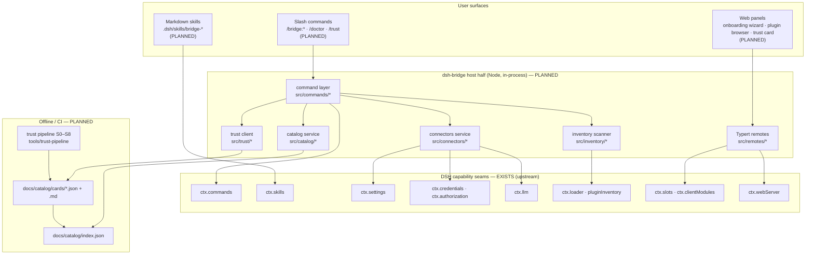
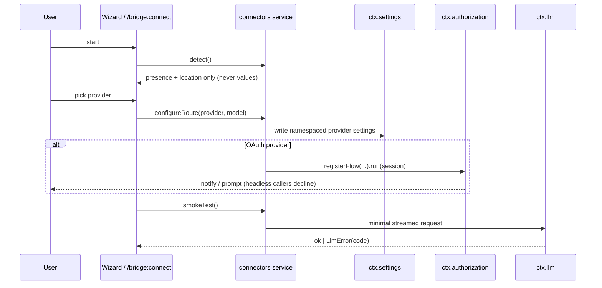
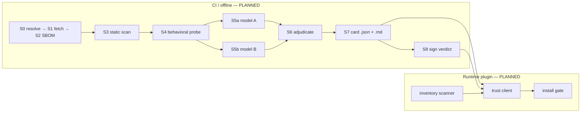
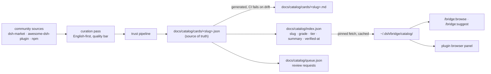

# dsh-bridge Architecture

> **Status: blueprint (v0.1).** Almost nothing in this document is built yet. Every section is
> explicitly marked **EXISTS** / **PLANNED** / **ASSUMED** so a reader never mistakes design for shipped code.
>
> - **EXISTS** — verified in the read-only DSH reference checkout at
>   `/Users/timurmonasypov/Documents/GitHub/reference/deepseek-harness` (master, shallow clone), or in this repo.
> - **PLANNED** — dsh-bridge code we intend to write. Does not exist on disk today.
> - **ASSUMED** — a claim inferred from upstream READMEs/manifests but not exercised against a running build.
>   Each carries the reference path that would confirm or refute it.
>
> Grounding for the seams cited here: [`docs/research/dsh-capability-seams.md`](research/dsh-capability-seams.md).
> Trust-stage semantics: [`docs/trust/pipeline-architecture.md`](trust/pipeline-architecture.md).
> Product intent: [`CHARTER.md`](../CHARTER.md).

---

## 1. Repository status today (EXISTS)

The repo is currently **documentation only**. There is no `src/`, no `package.json`, no build.

```
dsh-bridge/
├── CHARTER.md  CONTRIBUTING.md  LICENSE  README.md  SECURITY.md
└── docs/
    ├── architecture.md          ← this file
    ├── audits/                  dsh-builtin-redteam.md
    ├── design/                  onboarding-wizard.md, trust-report-card.md
    ├── growth/                  reddit-launch-kit.md, show-hn-draft.md, star-strategy-benchmarks.md
    ├── plugin-author-guide.md
    ├── research/                dsh-capability-seams.md, ecosystem-audit.md, portable-features.md
    ├── specs/commands/          doctor.md, review.md, suggest.md, trust.md
    └── trust/                   pipeline-architecture.md
```

Everything in §2 onward describes the shape we are building **toward**.

---

## 2. Component map



---

## 3. Plugin package layout (PLANNED)

Single package, two halves — the shape proven by upstream `packages/client/ui-commands`
(host code under `src/`, browser code under `src/client/`, exported as `./client` with a
`"dsh": {"client": {...}}` manifest block; **EXISTS**:
`reference/deepseek-harness/packages/client/ui-commands/package.json`). The bundle/patch shape
follows `docs/user/develop/basic/publish.md` in the same checkout.

```
dsh-bridge/                    (PLANNED tree)
├── package.json               # dsh.bundle + dsh.client blocks, peer deps
├── cordis.patch.yml           # the layer a profile applies when it lists this bundle
├── src/
│   ├── index.ts               # apply(ctx, config): mounts every sub-service
│   ├── config.ts              # Schemastery Config schema (real Schema, not a plain object)
│   ├── commands/              # one file per command; register on ctx.commands
│   │   ├── doctor.ts  trust.ts  browse.ts  install.ts  suggest.ts  review.ts
│   │   └── registry.ts        # table-driven registration + disposer collection
│   ├── connectors/            # detect → configure → verify (§5)
│   │   ├── detect/{claude,codex,opencode,env}.ts
│   │   ├── routes.ts          # writes provider settings
│   │   └── smoke.ts           # ctx.llm round-trip
│   ├── catalog/               # fetch/cache/query the curated index (§7)
│   ├── trust/                 # read cards, render text/rich, queue reviews (§6)
│   ├── inventory/             # what's installed on disk + in the loader (§6.1)
│   └── remotes/               # Typert remote defs consumed by the browser half
├── src/client/                # browser half — React + CSS Modules only
│   ├── index.ts               # ctx.slots.inject() registrations
│   ├── wizard/                # onboarding wizard (docs/design/onboarding-wizard.md)
│   ├── browser/               # plugin browser panel
│   └── card/                  # trust report card component
├── skills/                    # markdown skills shipped into a skill-filesystem root
└── tools/trust-pipeline/      # CI-only; never loaded into the harness process
```

Rules we inherit (**EXISTS**, `docs/user/develop/basic/publish.md`):

- `dsh.bundle.patch` points at `cordis.patch.yml`; patch rows resolve the package **by name**, not path.
- Ship a prebuilt self-contained `lib/` — the loaded artifact is the bundle, not `src/`
  (the trust pipeline analyses the bundle for exactly this reason,
  [`docs/trust/pipeline-architecture.md` §1](trust/pipeline-architecture.md)).
- Peer-depend on `@deepseek-ai/cordis` and `@deepseek-ai/schemastery`; do **not** inline schemastery,
  whose DSL compiles callbacks via `new Function`. Keeping it external is what lets us claim
  `no-dynamic-eval-in-bundle` in our own report card. **(ASSUMED for exact versions — the
  dsh-ponytail checkout is not on this machine; CHARTER records cordis 4.0.1 / schemastery 3.18.x.)**
- Install path: `dsh plugin --profile <p> add github:deepseek-bridge/dsh-bridge#<sha>`.
  Git installs fetch sources and pnpm ≥10 blocks the `prepare` script until the user allowlists it in
  the profile's `pnpm-workspace.yaml` (`allowBuilds`) — install-time code execution outside any sandbox.
  Our installer must surface that warning and prefer sha-pinning.

---

## 4. Command layer (PLANNED)

### 4.1 Slash commands

Seam: `ctx.commands.register({ name, description, input?, handler })`, `inject: ['commands']`
(**EXISTS**: `packages/interaction/commands/README.md`, `src/types.ts`). Handlers return
`{ kind: 'success' | 'error', text }`, are rendered by whichever UI adapter is composed, cost zero
tokens, and never reach the model unless the handler explicitly schedules agent work.
Registration returns a disposer; unload unwinds it.

| Command | Backing service | Spec |
|---|---|---|
| `/doctor` | inventory + connectors (read-only checks) | [specs/commands/doctor.md](specs/commands/doctor.md) |
| `/trust <plugin>` | trust client (reads committed cards) | [specs/commands/trust.md](specs/commands/trust.md) |
| `/bridge:browse` | catalog service | — |
| `/bridge:install <plugin>` | catalog + trust gate + installer | — |
| `/bridge:suggest` | catalog intent match | [specs/commands/suggest.md](specs/commands/suggest.md) |
| `/bridge:review` | trust pipeline invocation | [specs/commands/review.md](specs/commands/review.md) |
| `/bridge:connect [provider]` | connectors service | [design/onboarding-wizard.md](design/onboarding-wizard.md) |

Known constraint to design around (**EXISTS**, registry "Known Limitations"): command input is
**unstructured text only** — no typed args or forms. Each handler owns its own parse, and anything
needing structured choice escalates to the wizard panel or an interactive prompt. Adapters reject
unknown slash input rather than forwarding it, so discovery rides `commands/change` + `list(agent)`.

### 4.2 Skills

For Claude-Code-style markdown commands, the seam is `ctx.skills` via `skill-filesystem`, which scans
`.dsh/skills`, `.agents/skills`, `$DSH_HOME/skills` with watch/HMR (**EXISTS**:
`packages/skill/skill-filesystem/README.md`). Frontmatter carries `name`, `description`, `whenToUse`,
`user-invocable`, `disable-model-invocation`. dsh-bridge ships `skills/` content into a root rather
than implementing a provider — porting frontmatter semantics is translation, not new machinery.

**Split rule.** Deterministic, evidence-printing, zero-token work → slash command. Judgement work the
model should perform with context → skill. `/trust` is a command; "help me harden this plugin" is a skill.

---

## 5. Connectors service (PLANNED)

Three upstream seams compose; only step 1 is plain Node.



1. **Detect** — read `~/.claude`, `~/.codex/auth.json`, opencode `auth.json`, env vars with plain Node
   `fs`. No DSH seam involved. Reports **presence and location only**; a secret value never crosses a
   function boundary, never lands in a log, a tooltip, or an error string (CHARTER: "never print
   secrets; never exfiltrate").
2. **Configure** — write provider routes through the settings seam, namespaced via the
   `installSettingsSection` pattern (**EXISTS**: `docs/cookbook/adding-a-settings-card.md`). Config
   carries *references*; the managed credential document holds values and returns redacted/write-only
   views (**EXISTS**: `ctx.settings` / `ctx.credentials` rows in the generated
   `docs/capability-seams.md`). **ASSUMED**: pi-ai routes go live without restart — the Models page
   writes the same section (`packages/bundle/base/cordis.patch.yml`, `llm-pi-ai` row).
3. **Verify** — one minimal `ctx.llm` request against the new route; native OAuth via
   `ctx.authorization.registerFlow({key,label,methods,run})`, which owns its conversation with the
   human through `session.notify` / `session.prompt` and commits the credential before resolving
   (**EXISTS**: `packages/credentials/authorization/README.md`). One attempt per key; cancel supported.

Failure taxonomy (401/403, unreachable, unknown model, rate limit, timeout, local daemon down) is
specified in [design/onboarding-wizard.md §5](design/onboarding-wizard.md).

---

## 6. Trust pipeline integration points

The pipeline itself (S0 resolve → S8 sign) is offline and lives in CI; it is **not** loaded into the
harness. The runtime plugin only *reads its artifacts*. Full stage semantics:
[trust/pipeline-architecture.md](trust/pipeline-architecture.md).



**Integration point 1 — read path (`/trust`, browser panel).** Resolution order is
local catalog card → repo `docs/catalog/cards/<slug>.json` → local cache
`~/.dsh/bridge/trust-cache/<slug>.json` → unreviewed path. No network at read time; no grade renders
without a `verified-at` commit SHA; absence of findings is reported as "no findings in scanned
surface", never "safe". (specs/commands/trust.md)

**Integration point 2 — install gate (`/bridge:install`).** Preference order: existing verified plugin
→ scaffold-it-yourself with agent assistance → raw install behind explicit risk consent. The gate also
surfaces the `allowBuilds` install-time-execution warning and refuses to grade a moving `github:` branch
or a `link:` source (`unpinnable-source` → grade `N/A`).

**Integration point 3 — inventory scanner.** Two sources, fused:

- **Runtime projection (EXISTS):** `pluginInventory/list` returns
  `{entryId, moduleName, enabled, fiberPhase}` per non-group Loader entry — deliberately point-in-time,
  with **no provenance, version, or bundle attribution and no mutation**
  (`packages/host/plugin-inventory/src/types.ts`). Good for "what is loaded"; insufficient for scoring.
- **Disk ground truth (EXISTS):** out-of-tree plugins are pnpm deps of the profile, so
  `$DSH_HOME/profiles/<p>/package.json` (`dsh.profile.bundles` order = layer order) plus each dep's
  `package.json` + `cordis.patch.yml` under `<profile>/node_modules/<pkg>/` is authoritative.
- **In-process option (EXISTS):** `loader` is injectable — `plugin-inventory` itself does
  `static inject = ['loader']` and reads `ctx.loader.entries()` (`packages/host/plugin-inventory/src/index.ts`).

**ASSUMED / open:** attributing a Loader entry back to the bundle that inserted it has no first-class
API; we replay the layer stack and key on row `id`, which breaks under cross-bundle id collisions.
Resolved git SHAs for auditability must come from pnpm lockfile state in the profile dir — location
unconfirmed. Both are tracked as open questions 4 and 5 in
[research/dsh-capability-seams.md §4](research/dsh-capability-seams.md).

Harvestable scan inputs, all without upstream change: full source of each installed package, manifest
and patch layers, `prepare`/build scripts, dynamic-eval signals (`eval`, `new Function`,
`child_process`), declared `Config` schemas, and lifecycle listeners visible as event names in source.

---

## 7. Catalog data flow (PLANNED)

Two artifacts, one generator, one consumer.



Invariants:

- `<slug>.json` is the **only** hand-authored-by-pipeline artifact; the `.md` is derived and CI fails on
  drift (specs/commands/trust.md §"single source of truth").
- Cards are immutable per `subject_digest`; a re-run supersedes rather than edits.
- The client fetches exactly one documented endpoint (the pinned index), caches it, and works offline
  from cache. Every other surface reads the cache. `/trust refresh` is the only read-path command
  permitted to touch the network.
- `docs/catalog/` does **not exist yet** — it is created by the first pipeline run.

---

## 8. UI panel components (PLANNED)

The browser half is a second entry in the same package: `exports["./client"]` plus
`"dsh": {"client": {"inject": [...], "platform": "web"}}`. The Node half scans enabled Loader entries
for `dsh.client` packages, builds the boot graph, and serves bundles under `/plugins`
(**EXISTS**: `packages/client/modules/README.md`; manifest example in `packages/client/ui-commands/package.json`).

| Component | Slot / host | Data source | Status |
|---|---|---|---|
| Onboarding wizard (6 steps) | overlay/panel slot | connectors remotes | PLANNED · spec'd |
| Plugin browser | sidebar or overlay slot | catalog cache remotes | PLANNED |
| Trust report card (rich) | inside browser + Settings tab | trust client remotes | PLANNED · spec'd |
| Settings card | `settings.plugins.tab`, auto-paired by namespace | settings seam | PLANNED |

Mechanics (**EXISTS**): components register via `ctx.slots.inject()` / `SlotCore.register(...)`, which
in one call declares child slots, a store seat, and the registrant's business face
(`packages/client/ui-slots/README.md`). Frame-wide floating UI belongs in `shell.overlay`, the pattern
used by the shipped `ui-cordis` approval panel (`packages/extensions/ui-cordis/README.md`). A Settings
tab comes free via `settings.plugins.tab` when the browser card shares the host namespace
(`docs/cookbook/adding-a-settings-card.md`). Host↔browser data travels over Typert remotes consumed
through the `api-remotes` facade (`ctx.remote.$mount()` / `$dispatch`, `packages/api/remotes/README.md`).

Styling is non-negotiable and upstream-governed (**EXISTS**: `reference/deepseek-harness/docs/web-styling.md`):
CSS Modules + `clsx`, no component library, no Tailwind; `--dsw-alias-*` semantic tokens only, never hex
literals; no theme selectors in feature CSS; preserve focus visibility and reduced-motion. Naming follows
`BRAND_GUIDELINES.md` — the product is "dsh-bridge", the DeepSeek Harness trademark never appears as a
product name.

**ASSUMED:** the full third-party-safe slot key catalog. Only `shell.overlay` and `settings.plugins.tab`
are documented; sidebar/composer keys are spread across `packages/client/*/README.md` and partly internal.
Closing move: compile the `SlotMap` declarations from `ui-layout` / `ui-conversation` source
(open question 2 in research/dsh-capability-seams.md).

---

## 9. Lifecycle and security posture (EXISTS, upstream guarantees)

- Every registration through `ctx` is undone on unload; the fiber state machine runs
  PENDING → LOADING → ACTIVE → UNLOADING → DISPOSED/FAILED
  (`docs/user/develop/framework/index.md`). Dependency-driven loading waits for injected services and
  auto-disposes dependents when a service disappears. HMR hot-replaces plugins on config edit.
- **Consequence we design around:** a plugin's effects run inside the host process. Sandboxing in DSH is
  per-tool-call, not per-plugin. So dsh-bridge ships zero dynamic code execution, keeps the trust
  pipeline out of the harness process entirely, and treats "installed" as "trusted with the whole process".
- Layer precedence: bundles in profile order → profile patch → `$DSH_HOME/cordis.patch.yml` →
  `--patch` overlays. Later layers win **per row**, and a patch replaces a row's entire `config` block
  (no deep merge) — relevant to anything dsh-bridge writes into a profile.

---

## 10. Build order (PLANNED)

1. Package skeleton + `cordis.patch.yml` + one trivial `/bridge:ping` command — proves the whole install
   and load path end to end before any feature exists.
2. `/doctor` — read-only, highest confidence, immediately useful, exercises inventory + settings reads.
3. Connectors detect + configure + smoke test (CLI first, wizard panel second).
4. Trust client read path against a hand-built card fixture; then the offline pipeline behind it.
5. Catalog index + `/bridge:browse`; then the browser panel.
6. `/bridge:install` with the trust gate last, since it is the only surface that mutates a user's profile.

---

## 11. Verification debt

Nothing in this document has been run. Before any of it is treated as fact:

- Exercise a draft command against a dev build (`pnpm dsh web --patch ./scratch/cordis.yml`) to settle
  command input ergonomics and the live slot key set.
- Confirm ponytail's exact peer-dep versions from its published `package.json` (checkout absent here).
- Confirm MCP hot-add: is there a supported runtime path, or must `/bridge:mcp` rewrite the profile patch
  and prompt a reload?
- Pin dev/testing to a tagged DSH release and re-run a smoke matrix per bump. DSH is developer preview;
  `ctx.commands`, slot shapes, and `pluginInventory` can all move.
