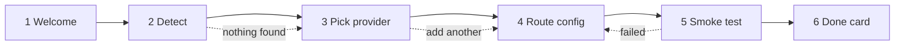

# Connectors / Onboarding Wizard — UX Spec

**Status:** Draft v1 · **Owner:** dsh-bridge design · **Surface:** DSH web UI (browser client)
**Scope:** The guided provider-connection flow described in [CHARTER.md](../../CHARTER.md) §"Connectors flow (Jcode-style auth onboarding)".

---

## 0. Grounding and constraints

This spec is written against the existing DSH web client conventions. Two upstream documents govern it:

- **Styling.** [`reference/deepseek-harness/docs/web-styling.md`](../../../reference/deepseek-harness/docs/web-styling.md):
  - "Use CSS Modules and `clsx`; do not add a component library or Tailwind." (line 15) — the wizard ships **no** new UI dependency. Every component in this spec is a plain React component with a co-located `.module.css`.
  - "Use `--dsw-alias-*` semantic tokens in feature components. Do not copy static palette values or write literal colors there." (line 16) — every color, spacing, radius, and motion value named below is a *semantic alias reference*, never a hex literal. If an alias for a state does not exist, it is added in `ui-theme/src/styles/` first ("Changing the system", line 25).
  - "Keep theme selectors out of feature component CSS." (line 17) — the wizard has **no** light/dark branches. It inherits the resolved theme snapshot applied by `ui-layout` (line 9).
  - "Pair font sizes with line heights and use the theme typography variables when an existing role matches." (line 18) — copy roles below map to existing typography variables, not ad-hoc sizes.
  - "Preserve keyboard focus visibility and reduced-motion behavior when adding transitions or hover-only controls." (line 21) — governs §7 accessibility and every transition in §6.
  - "Put presentation in CSS. Inline React styles may pass component-local custom-property values but must not encode theme branches." (line 20) — the step progress bar passes `--wizard-progress` inline; nothing else is inline.
- **Naming and brand.** [`reference/deepseek-harness/BRAND_GUIDELINES.md`](../../../reference/deepseek-harness/BRAND_GUIDELINES.md):
  - Product name in UI chrome is **"dsh-bridge"**, using the abbreviated "DSH" designation (line 8). The full "DeepSeek Harness" trademark never appears in a title, button, or product name (line 9).
  - Descriptive copy may say "built on DeepSeek Harness" (line 7) — used once, in the wizard footer, and nowhere else.
  - No official brand marks, logos, or DeepSeek visual assets appear in the wizard; nothing implies official endorsement (line 10).

Two charter principles are load-bearing on this flow and are treated as acceptance criteria, not aspirations:

- **"Never print secrets; never exfiltrate."** (CHARTER line 18) — no screen in this wizard ever renders a credential value, not masked, not truncated, not in a tooltip, not in a copyable field, not in an error message. Detection reports *presence and location*, never content. See Step 2 (§4) and §5.7.
- **"User owns their machine: no telemetry without opt-in, no network calls except documented ones."** (CHARTER line 32) — the only network call the wizard makes is the smoke test in Step 5, and it is announced in copy before it happens.

---

## 1. Flow at a glance



Six steps. Steps 3–5 can repeat per provider; Step 6 is terminal but offers "Connect another".

| # | Step | Purpose | Can skip? | Network? |
|---|------|---------|-----------|----------|
| 1 | Welcome | Set expectations, state the privacy contract | Yes ("Skip setup") | No |
| 2 | Detect existing credentials | Find local creds, save the user typing | Auto-advances | No |
| 3 | Pick provider | Choose what to connect | No | No |
| 4 | Route config | Map provider → DSH model routes | No | No |
| 5 | Smoke test | Prove it actually works | Yes ("Skip test") | **Yes, one call** |
| 6 | Done card | Confirm, show next actions | No | No |

**Entry points:** first run of the DSH web UI with no configured route; `/bridge:connect` slash command; Settings → Connectors → "Add connector".
**Exit contract:** the wizard writes only to the active DSH profile config (`~/.dsh/profiles/<name>/cordis.patch.yml`, CHARTER line 54). It never edits a source credential file it detected. Detection is read-only, always.

---

## 2. Layout shell

All six steps share one shell so the frame never jumps.

```
┌──────────────────────────────────────────────────────────────────────┐
│  dsh-bridge · Connect a provider                            [ Esc ✕ ] │
├──────────────────────────────────────────────────────────────────────┤
│  ●━━━━━●━━━━━○━━━━━○━━━━━○━━━━━○                                      │
│  Welcome Detect Provider Routes Test  Done                            │
├──────────────────────────────────────────────────────────────────────┤
│                                                                      │
│   [ STEP BODY — the only region that changes between steps ]         │
│                                                                      │
│                                                                      │
├──────────────────────────────────────────────────────────────────────┤
│  Built on DeepSeek Harness.        [ Back ]        [ Continue  → ]   │
└──────────────────────────────────────────────────────────────────────┘
```

- **Width:** a single content column, capped so line length stays readable; the shell centers in the viewport and drops to full-bleed with the same padding scale on narrow viewports.
- **Progress bar:** filled segments use the accent alias; upcoming segments use the muted border alias. The fill ratio is passed as a component-local custom property `--wizard-progress`, which is the one inline value permitted (web-styling line 20).
- **Footer:** the "Built on DeepSeek Harness." line is the single permitted use of the full trademark, as descriptive text only (BRAND_GUIDELINES line 7).
- **Primary action** sits bottom-right and keeps its position across all steps. Its label changes; its location never does.
- **`Esc`** closes the wizard and always routes through the "Leave setup?" confirm (§5.7) if any step past 1 has unsaved state.

---

## 3. Copy deck

English-first, friendly, zero jargon. Rules the deck obeys:

- **Say what happens, then what it costs the user.** "We'll look at your machine. Nothing leaves it."
- **No unexplained nouns.** "Route" is introduced in Step 4 with a one-sentence plain definition before it is used as a label.
- **Never blame the user.** Errors describe the situation and the next action. Never "invalid input".
- **Verbs on buttons.** "Connect", "Test it", "Try again" — not "OK", "Submit", "Next" (except the neutral "Continue").
- **Sentence case everywhere.** Titles, buttons, labels. No Title Case, no ALL CAPS.
- **Second person, present tense, contractions allowed.** "You're set." not "Setup has been completed."
- **i18n-ready:** every string below is a keyed entry (`wizard.step1.title`), no runtime string concatenation, no embedded markup, and plurals go through the plural-form helper rather than `+ "s"` (CHARTER line 30, English-first, i18n-ready).

### Global strings

| Key | Copy |
|-----|------|
| `wizard.title` | Connect a provider |
| `wizard.footer.attribution` | Built on DeepSeek Harness. |
| `wizard.action.back` | Back |
| `wizard.action.continue` | Continue |
| `wizard.action.cancel` | Cancel |
| `wizard.close.confirm.title` | Leave setup? |
| `wizard.close.confirm.body` | Your progress isn't saved yet. You can start again any time from Settings → Connectors. |
| `wizard.close.confirm.stay` | Keep going |
| `wizard.close.confirm.leave` | Leave setup |

---

## 4. Steps

### Step 1 — Welcome

**Goal:** two sentences of expectation-setting and one explicit privacy promise, then get out of the way.

```
┌──────────────────────────────────────────────────────────────────────┐
│  dsh-bridge · Connect a provider                            [ Esc ✕ ] │
├──────────────────────────────────────────────────────────────────────┤
│  ●━━━━━○━━━━━○━━━━━○━━━━━○━━━━━○                                      │
├──────────────────────────────────────────────────────────────────────┤
│                                                                      │
│   Let's get you a working model.                                     │
│                                                                      │
│   This takes about a minute. We'll find the accounts you            │
│   already have, wire one up, and send a test message so you          │
│   know it works before you rely on it.                              │
│                                                                      │
│   ┌────────────────────────────────────────────────────────────┐    │
│   │  🔒  Three promises                                         │    │
│   │                                                            │    │
│   │  • We read your local config files. We never change them.  │    │
│   │  • We never show, copy, or send your keys anywhere.        │    │
│   │  • One network call happens in this whole flow: the test   │    │
│   │    message at the end. We'll ask first.                    │    │
│   └────────────────────────────────────────────────────────────┘    │
│                                                                      │
├──────────────────────────────────────────────────────────────────────┤
│  Built on DeepSeek Harness.     [ Skip setup ]     [ Get started → ] │
└──────────────────────────────────────────────────────────────────────┘
```

**Copy**

| Key | Copy |
|-----|------|
| `wizard.step1.title` | Let's get you a working model. |
| `wizard.step1.body` | This takes about a minute. We'll find the accounts you already have, wire one up, and send a test message so you know it works before you rely on it. |
| `wizard.step1.promises.title` | Three promises |
| `wizard.step1.promises.1` | We read your local config files. We never change them. |
| `wizard.step1.promises.2` | We never show, copy, or send your keys anywhere. |
| `wizard.step1.promises.3` | One network call happens in this whole flow: the test message at the end. We'll ask first. |
| `wizard.step1.action.primary` | Get started |
| `wizard.step1.action.skip` | Skip setup |

**States**

| State | Behavior |
|-------|----------|
| Default | As drawn. Primary is focused on mount. |
| Returning user (a connector already exists) | Title becomes `wizard.step1.title.returning` — "Add another provider." Promise card collapses to a one-line summary with a "What we do and don't do" disclosure. |
| Skip setup | Closes wizard, drops a dismissible banner in the main UI: "No provider connected yet. Set one up →". No confirm dialog; nothing was entered. |

---

### Step 2 — Detect existing credentials

**Goal:** do the boring work for the user, and prove we did it safely.

Scan targets (CHARTER line 18): `~/.claude`, `~/.codex`, OpenCode `auth.json`, Jcode config, and provider environment variables. Read-only, presence-only.

```
┌──────────────────────────────────────────────────────────────────────┐
│  ●━━━━━●━━━━━○━━━━━○━━━━━○━━━━━○                                      │
├──────────────────────────────────────────────────────────────────────┤
│                                                                      │
│   Looking around your machine…                                       │
│   Reading only. We're checking which files exist, not what's in     │
│   them.                                                              │
│                                                                      │
│   ┌────────────────────────────────────────────────────────────┐    │
│   │ ✓  Claude Code          ~/.claude/            found        │    │
│   │ ✓  Codex                ~/.codex/             found        │    │
│   │ ⋯  OpenCode             auth.json             checking…    │    │
│   │ ○  Jcode                ~/.jcode/             not found    │    │
│   │ ✓  Environment          2 provider variables  found        │    │
│   └────────────────────────────────────────────────────────────┘    │
│                                                                      │
│   ▸ What exactly did we read?                                        │
│                                                                      │
├──────────────────────────────────────────────────────────────────────┤
│  Built on DeepSeek Harness.        [ Back ]        [ Continue  → ]   │
└──────────────────────────────────────────────────────────────────────┘
```

**Copy**

| Key | Copy |
|-----|------|
| `wizard.step2.title.scanning` | Looking around your machine… |
| `wizard.step2.title.done` | Found {count, plural, one {# account} other {# accounts}} you can use. |
| `wizard.step2.title.empty` | No saved accounts here yet. |
| `wizard.step2.subtitle` | Reading only. We're checking which files exist, not what's in them. |
| `wizard.step2.status.found` | found |
| `wizard.step2.status.checking` | checking… |
| `wizard.step2.status.missing` | not found |
| `wizard.step2.status.unreadable` | can't read this one |
| `wizard.step2.disclosure` | What exactly did we read? |
| `wizard.step2.disclosure.body` | We checked whether each path above exists and whether it holds a credential entry. We did not open, display, copy, or transmit any credential value. You can see the exact paths in the list above. |
| `wizard.step2.empty.body` | That's fine — it just means you'll paste a key or sign in on the next screen. |
| `wizard.step2.action.primary` | Continue |
| `wizard.step2.action.rescan` | Scan again |

**States**

| State | Trigger | Behavior |
|-------|---------|----------|
| Scanning | On mount | Rows stream in as each target resolves. Row spinner uses the shared motion tokens and is replaced by a static "checking…" label under `prefers-reduced-motion`. Primary is disabled and reads "Continue" (never a spinner label). |
| Found (≥1) | Scan complete | Title switches to the count form. Auto-advance after 1.2 s **only if** the user has not interacted; any keypress, focus move, or pointer move cancels auto-advance and leaves the user in control. Auto-advance never fires when a screen reader is driving focus (see §7). |
| Empty (0) | Scan complete | Title/empty body shown. Primary is enabled and reads "Continue". No error styling — an empty machine is a normal machine. |
| Partial failure | A path exists but is unreadable (permissions) | That row reads "can't read this one" in the warning alias with a `?` affordance: "We don't have permission to read this path. That's usually fine — you can still connect manually on the next screen." Flow continues. **Never** an error state. |
| Scan error | Whole scan threw | Inline notice: "We couldn't finish looking around. You can still set this up by hand." + [ Scan again ] + [ Continue ]. |

**Detection is never destiny.** Even with five detections, Step 3 still lets the user pick anything, including a provider we did not detect.

---

### Step 3 — Pick provider

**Goal:** one clear choice, with detected options surfaced first and everything else one scroll away.

```
┌──────────────────────────────────────────────────────────────────────┐
│  ●━━━━━●━━━━━●━━━━━○━━━━━○━━━━━○                                      │
├──────────────────────────────────────────────────────────────────────┤
│                                                                      │
│   Which one should DSH use?                                          │
│   You can add more later. Start with whichever you use most.        │
│                                                                      │
│   Ready to go                                                        │
│   ┌────────────────────────────────────────────────────────────┐    │
│   │ (•) Claude Code            Signed in already        ✓      │    │
│   ├────────────────────────────────────────────────────────────┤    │
│   │ ( ) Codex                  Signed in already        ✓      │    │
│   ├────────────────────────────────────────────────────────────┤    │
│   │ ( ) OpenAI (env var)       Key found in your shell  ✓      │    │
│   └────────────────────────────────────────────────────────────┘    │
│                                                                      │
│   Needs a key                                                        │
│   ┌────────────────────────────────────────────────────────────┐    │
│   │ ( ) DeepSeek               You'll paste a key              │    │
│   ├────────────────────────────────────────────────────────────┤    │
│   │ ( ) OpenRouter             You'll paste a key              │    │
│   ├────────────────────────────────────────────────────────────┤    │
│   │ ( ) Local model (Ollama)   Runs on this machine            │    │
│   ├────────────────────────────────────────────────────────────┤    │
│   │ ( ) Something else         Custom endpoint                 │    │
│   └────────────────────────────────────────────────────────────┘    │
│                                                                      │
├──────────────────────────────────────────────────────────────────────┤
│  Built on DeepSeek Harness.        [ Back ]        [ Continue  → ]   │
└──────────────────────────────────────────────────────────────────────┘
```

**Copy**

| Key | Copy |
|-----|------|
| `wizard.step3.title` | Which one should DSH use? |
| `wizard.step3.subtitle` | You can add more later. Start with whichever you use most. |
| `wizard.step3.group.ready` | Ready to go |
| `wizard.step3.group.needsKey` | Needs a key |
| `wizard.step3.badge.signedIn` | Signed in already |
| `wizard.step3.badge.envFound` | Key found in your shell |
| `wizard.step3.badge.needsKey` | You'll paste a key |
| `wizard.step3.badge.local` | Runs on this machine |
| `wizard.step3.badge.custom` | Custom endpoint |
| `wizard.step3.action.primary` | Continue |

**States**

| State | Behavior |
|-------|----------|
| Default | First detected provider preselected. If nothing was detected, nothing is preselected and the primary is disabled with helper text: "Pick one to keep going." |
| Selected | Card gets the selected border + subtle selected surface alias. Selection is a real radio group, so arrow keys move between options and only the group holds one tab stop. |
| Detected but stale | Provider found, credential entry looks expired or empty: badge reads "Found, but it looks expired" in the warning alias. Still selectable; Step 4 will offer re-auth. |
| Custom endpoint | Selecting "Something else" expands an inline field group in Step 4 rather than here, keeping this step a pure choice. |
| Local model, daemon down | Badge reads "Not running right now" and the card shows a hint: "Start it, then pick Scan again on the previous screen." Still selectable — the smoke test will confirm. |

---

### Step 4 — Route config

**Goal:** map the provider onto DSH model routes without teaching a config language. This is the only step where a DSH-native concept appears, so it gets a plain-English definition **before** the word is used as a label.

```
┌──────────────────────────────────────────────────────────────────────┐
│  ●━━━━━●━━━━━●━━━━━●━━━━━○━━━━━○                                      │
├──────────────────────────────────────────────────────────────────────┤
│                                                                      │
│   Pick your models                                                   │
│   DSH asks a model for different jobs. Choose which model            │
│   handles each one. The defaults are good — change them only        │
│   if you want to.                                                    │
│                                                                      │
│   Provider: Claude Code · signed in                    [ Change ]    │
│                                                                      │
│   Everyday work                                                      │
│   ┌────────────────────────────────────────────────────────────┐    │
│   │  claude-opus-5                                        ▾    │    │
│   └────────────────────────────────────────────────────────────┘    │
│   Handles your chats and code edits.                                │
│                                                                      │
│   Quick jobs                                                         │
│   ┌────────────────────────────────────────────────────────────┐    │
│   │  claude-haiku-5                                       ▾    │    │
│   └────────────────────────────────────────────────────────────┘    │
│   Summaries, titles, small lookups. Cheaper and faster.             │
│                                                                      │
│   ▸ Advanced: base URL, timeouts, headers                            │
│                                                                      │
│   Saving to profile: web                                             │
│                                                                      │
├──────────────────────────────────────────────────────────────────────┤
│  Built on DeepSeek Harness.        [ Back ]        [ Test it  → ]    │
└──────────────────────────────────────────────────────────────────────┘
```

**Key-entry variant** (provider needs a key):

```
│   Paste your DeepSeek key                                            │
│   ┌────────────────────────────────────────────────────────────┐    │
│   │  ••••••••••••••••••••••••••••••••••••••          [ Show ]  │    │
│   └────────────────────────────────────────────────────────────┘    │
│   Stored in your DSH profile on this machine. Never shown again     │
│   after you leave this screen, and never sent anywhere except       │
│   the provider you picked.                                          │
│   Where do I find this? →                                            │
```

**Copy**

| Key | Copy |
|-----|------|
| `wizard.step4.title` | Pick your models |
| `wizard.step4.subtitle` | DSH asks a model for different jobs. Choose which model handles each one. The defaults are good — change them only if you want to. |
| `wizard.step4.provider.label` | Provider |
| `wizard.step4.provider.change` | Change |
| `wizard.step4.role.main` | Everyday work |
| `wizard.step4.role.main.help` | Handles your chats and code edits. |
| `wizard.step4.role.fast` | Quick jobs |
| `wizard.step4.role.fast.help` | Summaries, titles, small lookups. Cheaper and faster. |
| `wizard.step4.advanced` | Advanced: base URL, timeouts, headers |
| `wizard.step4.profile` | Saving to profile: {profile} |
| `wizard.step4.key.label` | Paste your {provider} key |
| `wizard.step4.key.help` | Stored in your DSH profile on this machine. Never shown again after you leave this screen, and never sent anywhere except the provider you picked. |
| `wizard.step4.key.where` | Where do I find this? |
| `wizard.step4.key.show` | Show |
| `wizard.step4.key.hide` | Hide |
| `wizard.step4.action.primary` | Test it |

**States**

| State | Behavior |
|-------|----------|
| Default | Defaults prefilled from the provider's known model list. Primary enabled. |
| Model list loading | Selects show "Loading models…" and are disabled; a "Type a model name instead" link is always available so a slow or unavailable list never blocks the user. |
| Model list unavailable | Selects become free-text inputs with the note: "We couldn't fetch the list. Type the model name and we'll check it in the test." Not an error. |
| Key empty | Primary disabled, helper: "Paste your key to keep going." No red until the user has tried. |
| Key present | Masked by default. "Show" reveals **only** what the user typed in this session, and only while held/toggled on this screen; on leaving Step 4 the value is write-only and can never be re-displayed by the UI (CHARTER line 18). |
| Key looks wrong shape | Warning, not error: "That doesn't look like a {provider} key — they usually start with `{prefix}`. You can still try it." Never blocks. |
| Advanced open | Base URL, request timeout, extra headers. Each field has one line of plain help. Header values are masked with the same never-redisplay rule. |
| Same route already configured | Notice: "You already have a route here. Continuing will replace it." with [ Replace ] / [ Keep both ] when the schema allows a named second route. |

---

### Step 5 — Smoke test

**Goal:** prove it works, and make the one network call in the flow visible and consented.

```
┌──────────────────────────────────────────────────────────────────────┐
│  ●━━━━━●━━━━━●━━━━━●━━━━━●━━━━━○                                      │
├──────────────────────────────────────────────────────────────────────┤
│                                                                      │
│   Let's make sure it works                                           │
│   We'll send one short message to Claude and wait for a reply.      │
│   That's the only time this setup touches the network.              │
│                                                                      │
│   ┌────────────────────────────────────────────────────────────┐    │
│   │  ✓  Reached the provider                        142 ms     │    │
│   │  ✓  Your credentials were accepted                         │    │
│   │  ⋯  Waiting for a reply from claude-opus-5…                │    │
│   │  ○  Checking the quick-jobs model                          │    │
│   └────────────────────────────────────────────────────────────┘    │
│                                                                      │
│   Reply so far:                                                      │
│   ┌────────────────────────────────────────────────────────────┐    │
│   │  Hello! I'm here and working.                              │    │
│   └────────────────────────────────────────────────────────────┘    │
│                                                                      │
├──────────────────────────────────────────────────────────────────────┤
│  Built on DeepSeek Harness.     [ Skip test ]      [ Cancel test ]   │
└──────────────────────────────────────────────────────────────────────┘
```

**Copy**

| Key | Copy |
|-----|------|
| `wizard.step5.title` | Let's make sure it works |
| `wizard.step5.subtitle` | We'll send one short message to {provider} and wait for a reply. That's the only time this setup touches the network. |
| `wizard.step5.check.reach` | Reached the provider |
| `wizard.step5.check.auth` | Your credentials were accepted |
| `wizard.step5.check.reply` | Waiting for a reply from {model}… |
| `wizard.step5.check.fast` | Checking the quick-jobs model |
| `wizard.step5.reply.label` | Reply so far: |
| `wizard.step5.action.run` | Run the test |
| `wizard.step5.action.cancel` | Cancel test |
| `wizard.step5.action.skip` | Skip test |
| `wizard.step5.action.retry` | Try again |
| `wizard.step5.skip.note` | You can test any time from Settings → Connectors. |

**States**

| State | Behavior |
|-------|----------|
| Ready | Checks listed as pending. Primary reads "Run the test". Auto-runs on entry **only** because the subtitle announced it on the previous screen's primary button label ("Test it"); the consent is that button press. |
| Running | Checks resolve top to bottom. Streamed reply text appears as it arrives. Primary becomes "Cancel test" (destructive-neutral styling, not danger). |
| Passed | See Step 6 — auto-advance after the last check resolves, 800 ms, cancelable by any interaction. |
| Slow (>10 s) | Inline note appears without changing state: "This is taking longer than usual. Still waiting." + [ Cancel test ]. Never auto-fails before the configured timeout. |
| Canceled | Returns to Ready with a neutral note: "Test canceled. Nothing was saved or sent after you stopped it." |
| Failed | See §5 error recovery. |
| Skipped | Advances to Step 6 with the done card in its "untested" variant. |

---

### Step 6 — Done card

**Goal:** confirm the win, name exactly what changed, and offer the two things a user actually wants next.

```
┌──────────────────────────────────────────────────────────────────────┐
│  ●━━━━━●━━━━━●━━━━━●━━━━━●━━━━━●                                      │
├──────────────────────────────────────────────────────────────────────┤
│                                                                      │
│              ✓                                                       │
│                                                                      │
│        You're connected.                                             │
│        Claude Code is wired up and answering.                        │
│                                                                      │
│   ┌────────────────────────────────────────────────────────────┐    │
│   │  Provider      Claude Code                                 │    │
│   │  Everyday      claude-opus-5              tested ✓         │    │
│   │  Quick jobs    claude-haiku-5             tested ✓         │    │
│   │  Round trip    980 ms                                      │    │
│   │  Profile       web                                         │    │
│   │  Saved to      ~/.dsh/profiles/web/cordis.patch.yml        │    │
│   └────────────────────────────────────────────────────────────┘    │
│                                                                      │
│   What next?                                                         │
│   → Start a chat                                                     │
│   → Browse verified plugins                                          │
│   → Connect another provider                                         │
│                                                                      │
├──────────────────────────────────────────────────────────────────────┤
│  Built on DeepSeek Harness.                        [ Start chatting ]│
└──────────────────────────────────────────────────────────────────────┘
```

**Copy**

| Key | Copy |
|-----|------|
| `wizard.step6.title` | You're connected. |
| `wizard.step6.subtitle` | {provider} is wired up and answering. |
| `wizard.step6.subtitle.untested` | {provider} is saved. We haven't tested it yet. |
| `wizard.step6.summary.provider` | Provider |
| `wizard.step6.summary.main` | Everyday |
| `wizard.step6.summary.fast` | Quick jobs |
| `wizard.step6.summary.latency` | Round trip |
| `wizard.step6.summary.profile` | Profile |
| `wizard.step6.summary.path` | Saved to |
| `wizard.step6.badge.tested` | tested |
| `wizard.step6.badge.untested` | not tested |
| `wizard.step6.next.title` | What next? |
| `wizard.step6.next.chat` | Start a chat |
| `wizard.step6.next.plugins` | Browse verified plugins |
| `wizard.step6.next.another` | Connect another provider |
| `wizard.step6.action.primary` | Start chatting |
| `wizard.step6.action.primary.untested` | Run the test now |

**States**

| State | Behavior |
|-------|----------|
| Tested | As drawn. Check icon animates in once (fade + 4px rise, ~180 ms); under `prefers-reduced-motion` it simply appears (web-styling line 21). |
| Untested (test skipped) | Check mark replaced with a neutral info mark. Both model rows show "not tested". Primary becomes "Run the test now"; "Start chatting" moves to a secondary link. Honest, not alarming. |
| Partial pass | Everyday model tested, quick-jobs failed: everyday row "tested ✓", quick row "didn't answer" in warning alias, plus a line: "DSH will fall back to your everyday model for quick jobs until this is fixed." + [ Fix quick jobs ] returning to Step 4 with that field focused. |
| Second connector | Title becomes "Added." and the summary card lists all configured connectors, newest first, with a "default" tag on the active one. |

**"Saved to" is a path, never a value.** The card names the file; it never previews its contents.

---

## 5. Error recovery

Principles: **name what happened → say what it likely means → give one primary fix → keep the escape hatch.** No error dead-ends. No raw stack traces in the body; raw detail is always available behind a "Technical details" disclosure for people who want it, and that detail is **redacted of any credential-shaped token before it reaches the DOM**.

### 5.1 Auth rejected (401 / 403)

```
┌────────────────────────────────────────────────────────────┐
│  ✕  The provider didn't accept your credentials            │
│                                                            │
│  Claude replied "unauthorized". Usually that means the     │
│  key is expired, revoked, or belongs to a different        │
│  account than you expected.                                │
│                                                            │
│  [ Enter a different key ]   [ Try again ]                 │
│  ▸ Technical details                                       │
└────────────────────────────────────────────────────────────┘
```

Primary returns to Step 4 with the key field focused and cleared. We never re-show the rejected value.

### 5.2 Network unreachable

- **Body:** "We couldn't reach {provider}. That's usually a network problem on this side — a VPN, a proxy, or an offline moment."
- **Actions:** [ Try again ] primary · [ Set a proxy ] opens Step 4 advanced with the header/base URL fields · [ Skip for now ] keeps config saved and marks it untested.

### 5.3 Model not found (404 / unknown model)

- **Body:** "{provider} doesn't recognize `{model}`. It may have been renamed or it may not be on your plan."
- **Actions:** [ Pick a different model ] returns to Step 4 with that select open and, when a list is available, the closest matching names surfaced first.

### 5.4 Rate limited / quota

- **Body:** "{provider} is asking us to slow down. Your setup is probably fine — this is a limit on their side."
- **Actions:** [ Try again in {n}s ] with a live countdown on the button when a `Retry-After` is present, else a plain [ Try again ] · [ Save without testing ].
- Never presented as a configuration failure. The route is saved either way.

### 5.5 Timeout

- **Body:** "No reply within {n} seconds. The provider may be busy, or the endpoint may be wrong."
- **Actions:** [ Try again ] · [ Check the endpoint ] → Step 4 advanced.

### 5.6 Local daemon not running (Ollama and friends)

- **Body:** "Nothing is listening at {url}. If you're running a local model, start it and try again."
- **Actions:** [ Try again ] · [ Change the address ].
- The URL is echoed because it is not a secret. Nothing else from the request is echoed.

### 5.7 Write failed (config not saved)

Most serious case, since the user believes they finished.

- **Title:** "We couldn't save your settings"
- **Body:** "Writing to {path} failed: {reason}. Nothing was changed — your existing setup is untouched."
- **Actions:** [ Try saving again ] primary · [ Copy the settings ] which copies a **redacted** YAML block (keys replaced with `<your-key>` placeholders) so the user can paste it manually.
- The wizard does **not** advance to the done card. A done card that lies is worse than an error.

### 5.8 Leaving mid-flow

`Esc` or `✕` past Step 1 with unsaved state:

```
┌────────────────────────────────────────────────┐
│  Leave setup?                                  │
│  Your progress isn't saved yet. You can start  │
│  again any time from Settings → Connectors.    │
│                                                │
│           [ Keep going ]   [ Leave setup ]     │
└────────────────────────────────────────────────┘
```

Focus moves to "Keep going". `Esc` inside this dialog dismisses the dialog, not the wizard.

### 5.9 Error styling contract

Every error surface uses the semantic danger/warning **aliases** from `ui-theme`, never literal colors (web-styling line 16). If a needed state alias does not exist, it is added to the theme package first (web-styling line 25). Color is never the only signal: each state carries an icon and a text label, so it survives grayscale and color-vision differences.

---

## 6. Motion

- Step transitions: 160 ms cross-fade plus 8px horizontal slide in the direction of travel. Values come from the theme motion tokens; the wizard defines no durations of its own.
- Check-row resolution in Steps 2 and 5: icon swap with a 120 ms fade. No bouncing, no confetti.
- **`prefers-reduced-motion: reduce` removes all slide and fade**; steps swap instantly and spinners become static text labels (web-styling line 21). This is a hard requirement, not a nicety, because the wizard is a first-run surface and first-run surfaces are where vestibular triggers do the most damage.

---

## 7. Accessibility

**Structure**

- The wizard is a modal `dialog` with `aria-modal="true"` and `aria-labelledby` pointing at the step title. Focus is trapped inside it and restored to the triggering control on close.
- Each step's title is the single `h2` in the dialog; body groups use `h3`. The heading order never skips.
- The progress indicator is a `nav` with an ordered list and `aria-current="step"` on the active item. It also carries a visually-hidden "Step {n} of 6: {name}" so the position is announced, not just drawn.

**Focus**

- On each step change, focus moves to the step heading (`tabindex="-1"`), so screen reader users hear the new context instead of landing mid-form.
- Focus visibility is never removed. Focus rings use the theme focus alias and must remain visible in both themes (web-styling line 21).
- Tab order is strictly visual order: body → back → primary.
- Provider choice is a real radio group: one tab stop, arrow keys to move, `Space` to select.

**Announcements**

- Steps 2 and 5 use an `aria-live="polite"` region for check results. Each row announces as a complete sentence: "Claude Code: found." "Credentials accepted." Not "✓".
- Errors are announced through `role="alert"` once, on appearance, and are also reachable in normal reading order.
- The streamed reply in Step 5 is **not** live-announced token by token; it updates a `aria-live="off"` region and announces once on completion as "Reply received."

**Auto-advance and assistive tech**

- Auto-advance (Steps 2 and 5) is disabled whenever the user has interacted, and always exposes an explicit primary button doing the same thing. Nothing in this flow is reachable **only** by waiting. If the user's environment signals reduced motion, auto-advance is disabled entirely and the primary must be pressed — a timed jump is a motion event too.

**Input**

- Every field has a persistent visible `label` element, never a placeholder-as-label.
- Help text is bound via `aria-describedby`; error text via `aria-describedby` plus `aria-invalid`.
- The key field is `type="password"` with `autocomplete="off"` and `spellcheck="false"`. The Show/Hide control is a `button` with `aria-pressed` and an accessible name that states the current action.
- Full keyboard operation: `Esc` closes (through the confirm), `Enter` activates the primary from anywhere except a multi-line field.

**Visual**

- Contrast meets WCAG 2.2 AA for text and 3:1 for meaningful non-text (state icons, focus rings, selected borders). Because all colors are theme aliases, this is verified once in `ui-theme` rather than per component.
- Layout is legible at 200% zoom and at 320px effective width; the shell reflows to a single column with no horizontal scrolling.
- Target size: interactive controls meet at least 24×24 CSS px, with provider cards far exceeding it.

---

## 8. Open questions

1. **Multi-route defaults.** When two connectors are configured, does the newest become default, or does the user choose? Current spec tags the active one but does not resolve the policy.
2. **Re-auth depth.** For OAuth-based providers (Claude Code, Codex), does Step 4 launch a browser flow or defer to the provider's own CLI? Deferring is safer for the "never handle secrets" promise and is the assumption in this draft.
3. **Trust layer hand-off.** "Browse verified plugins" in Step 6 assumes the trust report card surface (CHARTER line 20) exists. If it ships later, that link is hidden rather than shown broken.
4. **Skip-setup persistence.** How long does the "No provider connected yet" banner survive dismissal — session, or until a connector exists?

---

## 9. References

- [`CHARTER.md`](../../CHARTER.md) — connectors flow scope (line 18), UI-within-design-system requirement (line 25), no-secret-printing and machine-ownership principles (lines 18, 32), profile config path (line 54).
- [`reference/deepseek-harness/docs/web-styling.md`](../../../reference/deepseek-harness/docs/web-styling.md) — CSS Modules + `clsx`, no component library or Tailwind (line 15); `--dsw-alias-*` semantic tokens (line 16); no theme selectors in feature CSS (line 17); typography pairing (line 18); presentation in CSS (line 20); focus visibility and reduced motion (line 21); changing the system via `ui-theme` (line 25).
- [`reference/deepseek-harness/BRAND_GUIDELINES.md`](../../../reference/deepseek-harness/BRAND_GUIDELINES.md) — descriptive-use allowance (line 7); "DSH" naming preference (line 8); no trademark in product names (line 9); no implied endorsement (line 10).
