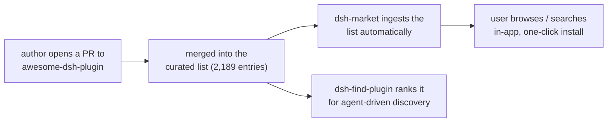

# Adoption diagnosis: why nobody has seen dsh-bridge

> Written 2026-08-30. Ground truth this document reasons from: 36 views, 2 unique
> visitors, 1 star, ~250 clones over the trailing window, of which 169 landed in a
> single day and match our own CI and swarm automation. The honest read is not
> "people try it and bounce." It is **almost nobody has ever seen it.** Bounce is
> not the problem when the room is empty.

This is a distribution diagnosis, not a pep talk. Sources are cited inline:
`docs/research/ecosystem-audit.md`, `docs/catalog/catalog-notes.md`,
`README.md`, and the live npm registry (fetched 2026-08-30).

---

## 1. Distribution reality: where the first 100 real users actually come from

DSH is a developer-preview ecosystem, so the usual answer ("SEO, npm search, word
of mouth") does not apply yet. There is exactly one dominant discovery pipe, and
it is a chain, not a channel.

### The actual mechanism a DSH user uses to find a plugin

Evidence for each hop:

- **dsh-market is the in-app store, and its catalog *is* the awesome list, picked
  up automatically** (`docs/research/ecosystem-audit.md:49`). It has 2,227 stars
  and 189k downloads. Critically, **dsh-market restricts installs to awesome-list
  sources** (`ecosystem-audit.md:125`). So a plugin that is not in the awesome
  list is not installable through the store the whole ecosystem uses. It is
  invisible where people look.
- **dsh-find-plugin** is the agent-facing discovery tool: GitHub topic search
  re-ranked by stars, with bilingual descriptions injected from the awesome
  list's `plugins.json` (`ecosystem-audit.md:50`). It reads the same two sources
  we are absent from.
- **Third-party desktop clients** (anywhere-labs/dsh-desktop, 20.2k stars) bundle
  the market (`ecosystem-audit.md:51`). Same feed, wider reach, same gate.

So for a DSH plugin the "first 100 real users" do not come from a launch post.
They come from being in the two upstream indexes the tooling reads:
**awesome-dsh-plugin and, through it, dsh-market.** Everything else is a trickle
on top of that spine.

### The concrete channels that exist TODAY for DSH users

| Channel | Reality for us today | Reachable without lying/spamming |
|---|---|---|
| awesome-dsh-plugin PR | The single highest-leverage action. Table stakes for market/find-plugin. | Yes: open an issue, then a PR. Their bar is shape + accurate description (`ecosystem-audit.md:57`). |
| dsh-market (in-app) | Flows automatically once we are in the awesome list. | Yes, downstream of the PR above. |
| dsh-find-plugin | Same: reads topics + awesome list. | Yes, downstream. |
| GitHub topics `dsh-plugin` (11,830) / `deepseek-harness-plugin` (450) | Direct search surface. The main topic is polluted, the stricter one is cleaner (`ecosystem-audit.md:20`). | Yes: set repo topics. Zero cost. |
| deepseek-ai/deepseek-harness discussions, WeChat/QQ groups | Where the ecosystem actually talks, and it is Chinese-first (`ecosystem-audit.md:130`). | Partially: discussions yes, the chat groups are not our language or turf. |
| HN / r/LocalLLaMA / r/ClaudeAI | Western, wide-open, but a pulse not a pipe (`docs/growth/star-strategy-benchmarks.md:51`). Converts English devs who may not run DSH. | Yes, once. |

The uncomfortable truth in that table: **five of the six rows are gated behind one
PR we have not opened.** The Western launch channels (HN, Reddit) reach people
who read English but may not be DSH users at all, which is why they produce stars,
not users.

---

## 2. The discoverability gap: every place a DSH user looks, and whether we are there

This is the actual todo list. It is short because the answer is almost uniformly
"no."

| Registry / list / topic / index | Are we present? | Note |
|---|---|---|
| awesome-dsh-plugin (curated list, 2,189 entries) | **No** | We index it (`faq.md:154`), we are not in it. This is the root cause of every other absence below. |
| dsh-market (in-app store) | **No** | Gated by awesome-list membership (`ecosystem-audit.md:125`). Absent upstream = absent here. |
| dsh-find-plugin (agent discovery) | **No** | Reads topics + awesome list. Same gate. |
| github.com/topics/dsh-plugin | **Yes** (set 2026-08-30) | Topic applied. |
| github.com/topics/deepseek-harness-plugin | **Yes** (set 2026-08-30) | The stricter, cleaner topic (450 repos); applied alongside `cordis`. |
| npm: package name `dsh-bridge` | **Taken, and not by us** | Owned by `baixianger`, described "Local session messaging and event bridge for DeepSeek Harness", actively published through `0.1.0-rc.15` on 2026-08-27, and it is *itself a DSH plugin bundle* (`dsh.bundle.patch` in its manifest). This is a live, colliding project, not a dead squat. We cannot ship under this name. |
| npm: package name `create-dsh-bridge` | **Unpublished (404)** | The README's hero command `npx create-dsh-bridge` (`README.md:35`) currently resolves to nothing. Our headline install path is dead on arrival until this is published. |
| Hosted catalog site | **No** | GitHub Pages was deliberately disabled by the owner; the site under `site/` is a local-only artifact. The catalog's canonical web-readable form is `docs/catalog/INDEX.md` on GitHub. |

Two of these are not gaps, they are bugs in the launch itself:

1. **The hero install command does not work.** `npx create-dsh-bridge` requires a
   published `create-dsh-bridge` on npm. There is none. A visitor who copies the
   one command the README leads with gets an error. That converts the best-case
   visitor (motivated enough to run it) into a bounce.
2. **The natural npm name is owned by a live competitor** with a confusingly
   similar name and pitch. Anyone who searches npm for "dsh bridge" finds *their*
   package, published more recently than we exist on npm. This is a naming
   collision we have to design around, not a formality.

---

## 3. Value legibility: the 10-second README test

A visitor gives the README about ten seconds and reads top-down. Here is what
lands and what does not, quoting exact lines.

### Lines that work

- **`README.md:10`** — "Familiar harness commands for DeepSeek Harness, with
  every plugin audited first." This is a real one-liner. It names the platform
  and the differentiator in one breath.
- **`README.md:24`** — "a DeepSeek Harness plugin for people arriving from Claude
  Code, Codex CLI, OpenCode, or Jcode... refuses to recommend a community plugin
  until an adversarial review has graded it." Borrowed-intent positioning done
  right: it uses names the reader already searches for.
- **`README.md:35`** — `npx create-dsh-bridge` followed by **`README.md:38`**
  "That is the whole thing." Strong promise. (Undercut by the fact that it does
  not run yet, see section 2.)

### Lines that lose the visitor

- **`README.md:1-8`** — a six-line ASCII-art banner is the literal first thing on
  the page. It burns the top of the first screenful on decoration, pushing the
  value prop below the fold on smaller windows.
- **`README.md:18`** — "Rendered from the specs rather than a running build." This
  is honest and correct to include, but placed directly under the hero image it
  tells a 10-second visitor "the thing in this picture is not real yet." For a
  project whose entire pitch is trust, the first caption should not read as a
  disclaimer that the demo is a mockup.
- **`README.md:66`** — "DSH ships no model, and the installer connects none. When
  it finishes you have a harness that boots and a bridge that answers
  `/bridge-help`, and nothing that answers a prompt." Accurate and admirable, but
  it arrives before the reader has any reason to care, and it reads as "this does
  not work end to end."
- **`README.md:131`** — the naming caveat: shipped commands are `/bridge-<name>`,
  not `/model`. The muscle-memory promise (`README.md:30`) is contradicted 100
  lines later. A refugee who reads both feels the gap.

**README verdict:** the *words* are above the bar for this ecosystem. The
*sequencing* buries the one exclusive claim (trust) under muscle-memory framing,
opens with decoration, and front-loads honest caveats before it has earned the
reader's interest. And the command it tells the visitor to run does not execute.
A good README pointed at an empty room is still an empty room, but this one would
also lose the few who arrive.

---

## 4. The honest question: real need, or solution looking for a problem?

Both cases, argued straight from the ecosystem data.

### The case that the need is real

- **Plugins are arbitrary code with no vetting layer.** awesome-dsh-plugin's own
  contributing guide states plainly, "Being listed is still not a security
  review" (`ecosystem-audit.md:57`). dsh-market's mitigations are supply-side
  only; nothing evaluates behavior (`ecosystem-audit.md:75`).
- **The ecosystem spontaneously grew five grassroots vetting tools** with no
  prompting from us (`ecosystem-audit.md:69-73`). People felt the gap hard enough
  to build for it. That is demand you cannot fake.
- **Security content earns real traction here:** toby-bridges/api-relay-audit has
  804 stars for local audit reports (`ecosystem-audit.md:74`). The market rewards
  this shape.
- **The English-first gap is documented:** ~33% of sampled listed repos have
  Chinese-only descriptions and READMEs skew further Chinese in the tail
  (`ecosystem-audit.md:38`). For an English reader, "which of these 340 UI
  plugins is good and safe" is genuinely unanswered.
- **Curation demand is proven at scale:** awesome-dsh-plugin has 12.6k stars for
  a plain list with no trust layer.

### The case that it is a solution looking for a problem

- **The 12.6k stars are for a *bilingual* list, and the audience is Chinese-first.**
  The people already in the ecosystem read Chinese and use dsh-market without
  friction. Our English-first framing serves an English DSH user who **may not
  exist in numbers yet** because DSH is a two-week-old preview whose early
  adopters are overwhelmingly Chinese (`ecosystem-audit.md:38`).
- **The trust product's natural audience (security-conscious English devs) is
  largely not on DSH at all.** So a Show HN converts them to *stars*, not to
  *users*, because using the product requires adopting an unfamiliar
  Chinese-first harness first. This matches the ground truth exactly: interest is
  hypothetical, usage is near zero.
- **Two of the three headline capabilities do not perform their named action.**
  The connectors flow detects credentials but does not write routes, and the
  installer prints a command instead of installing (`docs/reviews/pm-product-review.md:7`).
  A tool that does not do the job is a hard sell even to a willing user.
- **The muscle-memory half is already contested.** ccch1mneyyy/dsh-TUI (2k stars)
  ports a Claude-Code-style surface already (`ecosystem-audit.md:100`). We are not
  first, and our commands carry a `/bridge-` prefix that breaks the reflex.

### Verdict

**The trust need is real; the addressable audience for it *today* is very small,
and the project is currently shaped for a user who barely exists yet.** That is
not fatal, but it means the current strategy (polish a DSH plugin, launch to
English devs) is fighting the calendar. The two honest reshapes:

1. **Lead with the catalog as standalone content, not as a plugin feature.** The
   trust report cards are valuable to read even by someone who never installs DSH
   or dsh-bridge. That is the one artifact that works with zero adoption
   prerequisite. Make the *repo* the product and the plugin an optional runtime,
   not the other way around. This is already half-true and the README fights it.
2. **Get into the upstream feed so that the small-but-real DSH audience can find
   us at all.** Distribution first, polish second. Right now we are polishing a
   storefront on a street with no address.

If neither the catalog-as-content pivot nor the awesome-list entry happens, the
project will keep earning the occasional star from launch posts and zero users,
because it is invisible to the only pipe that carries users.

---

## 5. Ranked action list: from 2 visitors to first real users

Ordered by impact-per-effort. Effort: S (<= 1 day), M (2-5 days), L (1-3 weeks).
Every item is doable without lying, spamming, buying stars, or manipulating
metrics. Impact is directional, derived from sections 1-4, not a promise.

| # | Action | Effort | Expected impact | Why here |
|---|---|---|---|---|
| 1 | **Publish `create-dsh-bridge` to npm** (and verify `npx create-dsh-bridge` runs clean from a fresh machine). | S | High. Fixes a dead hero command (section 2). Zero point in any promotion while the first command 404s. | Nothing below matters if the one command the README leads with does not run. |
| 2 | **Resolve the npm name collision.** Pick a shippable plugin name that is not the live `baixianger/dsh-bridge`, e.g. an npm scope (`@dsh-bridge/plugin`) or a distinct name, and make it consistent across README, package.json, and catalog. | S | High. Removes a confusing collision with an active, similarly-named DSH plugin (section 2) and unblocks any npm-based install path. | A namespace clash on the exact product name is a silent conversion killer. |
| 3 | **Set GitHub repo topics** (`deepseek-harness-plugin`, `dsh-plugin`, `dsh`, `cordis-plugin`, `claude-code`, `agent-security`). | S | Medium, permanent. Puts us on the topic pages dsh-find-plugin reads (section 1). | Free, one settings change, and it is a discovery surface we are simply absent from. |
| 4 | **Open the awesome-dsh-plugin submission** (issue first, then PR), with an accurate English description that matches shipped behavior, not the charter. | M | Highest structural impact. This is the gate to dsh-market and dsh-find-plugin, i.e. the actual user pipe (section 1). | Everything in the distribution spine flows from this one merge. |
| 5 | **Make one capability actually perform its action** (write the route in `/connect apply`, or execute the vetted install). | M | High for retention. Converts a "documentation project" into a tool the awesome-list reviewer and first users can actually use (section 4). | The list's bar is "installs and works as described"; a no-op command fails that check. |
| 6 | **Reorder the README: trust first, hero command that works, caveats lower.** Drop or shrink the ASCII banner; move "rendered from specs" off the hero; lead with a real trust card. | S | Medium, multiplies every other channel's conversion. | The words are good; the sequence is not (section 3). Cheap, compounding. |
| 7 | **Ship the catalog as readable standalone content** with stable per-card URLs and an index that needs no install to be useful. Link it from the repo header. | M | Medium-high, and it is the one asset that works at zero adoption. | Aligns the product with the audience that exists today: readers, not yet users (section 4 reshape 1). |
| 8 | **Publish 3-5 flagship trust cards on the highest-traffic plugins** (OpenViking, hindsight, dsh-market itself) as individually linkable, quotable artifacts. | M | Medium. Each is durable, searchable content and a reason for that plugin's users to cite us. | Compounding-content loop; security cards demonstrably earn stars here (`ecosystem-audit.md:74`). |
| 9 | **One honest Show HN + one r/LocalLLaMA post**, only after items 1-6 are true. | S (to post) | Spiky, mostly stars not users; 92% of effect in 48h (`star-strategy-benchmarks.md:46`). | A pulse, worth doing once the funnel does not leak, but not a strategy. Ordered late on purpose. |
| 10 | **Post one substantive, non-promotional trust finding in deepseek-ai/deepseek-harness discussions** (e.g. the D-grade install-time-npm finding), citing evidence, not linking as an ad. | S | Low-medium, but it is where actual DSH users are. | Reaches real users in their venue by contributing, not marketing. High trust, low volume. |

Sequencing note: items 1, 2, 3, 6 are all S and unblock everything else. Do them
first, in a day. Item 4 is the single most important structural move and should
start (issue opened) the same day, because the review latency is out of our
control. Items 9 and 10 are deliberately last: promoting a leaky funnel to an
audience that cannot install the product is how you spend your one launch day for
nothing.

---

## Summary

The problem is not conversion, it is that the product is not present anywhere a
DSH user looks, and the one command the README leads with does not run. Fix the
install command, claim a usable name, set topics, and open the awesome-list PR
that is the gate to the entire in-app distribution spine. Reshape the pitch around
the catalog, the one asset that is valuable before anyone adopts anything. The
trust need is real; the audience for it is small and early; win distribution
before polish.
