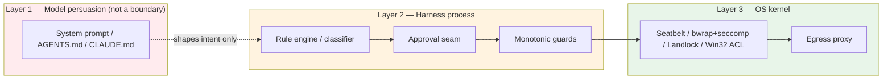
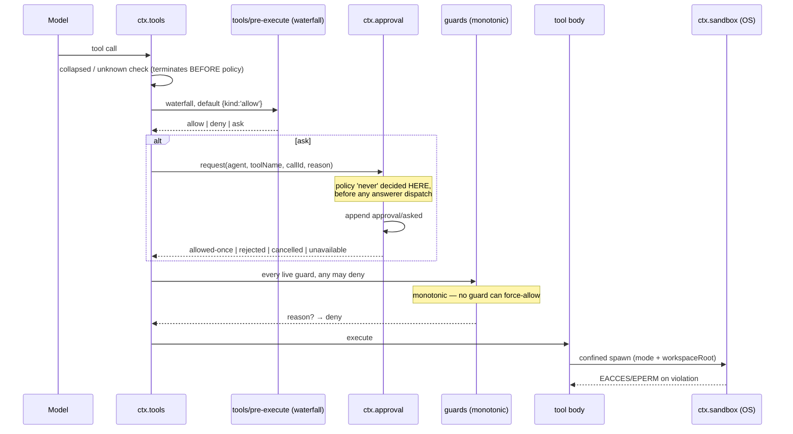

# Security model comparison: permission and approval architectures

> Wave research for [dsh-bridge](../../CHARTER.md). How Claude Code, Codex, Jcode, OpenCode, and DeepSeek Harness each answer *"may this action proceed?"* — and what dsh-bridge should adopt for its own plugin surface and document for users installing third-party plugins.

**Scope.** This is the **defense** half of the pair. The **attack** half is [`docs/audits/dsh-builtin-redteam.md`](../audits/dsh-builtin-redteam.md), which enumerates concrete attack chains against DSH built-ins and derives the trust-report-card checklist. This document does not repeat those chains. It compares the *architectures* — where each system places its boundary, what vocabulary it decides in, what it fails to, and who is allowed to weaken it — and turns that comparison into design constraints for dsh-bridge.

**Evidence.**

| Source | How cited | Pin |
|---|---|---|
| DeepSeek Harness | `file:line` in the read-only reference checkout | `b150a551b8d465e31e418e1b2eaf5e79bbb7d28e` (`dsh-v0.1.1-rc.2`, 2026-08-21) |
| Claude Code | Published docs (`docs.claude.com/en/docs/claude-code/…`) | Retrieved 2026-08-25 |
| Codex | Published docs (`developers.openai.com/codex/…`) | Retrieved 2026-08-25 |
| OpenCode | Published docs (`opencode.ai/docs/…`) | Retrieved 2026-08-25 |
| Jcode | Bundled build docs (`docs/SAFETY_SYSTEM.md`, status **Design**) | Build v0.80.1 |

Claims about the four non-DSH systems rest on vendor documentation, not source review; they are cited as documented behavior, not verified behavior. DSH claims cite source. Where a documented claim matters to a dsh-bridge decision, § 8 records the uncertainty rather than hiding it.

---

## 0. Executive summary

Five systems, four genuinely distinct architectures.

1. **Claude Code** — *rule-first, prompt-backed, optionally OS-enforced.* A three-verb (`deny`/`ask`/`allow`) rule engine over tool-plus-specifier patterns, layered across four settings scopes with an unoverridable managed tier, plus an optional Seatbelt/bubblewrap sandbox that adds **network egress** and **credential masking** to the boundary. The richest model of the five, and the only one that treats credential *masking* (not just blocking) as a first-class primitive.
2. **Codex** — *profile-first, OS-enforced, two orthogonal axes.* Sandbox mode (what is technically possible) and approval policy (when to stop and ask) are deliberately separate knobs, now generalized into declarative **permission profiles** with filesystem `read`/`write`/`deny` and per-domain network rules. Uniquely, it can route approvals to a **model reviewer** instead of the human (`approvals_reviewer = "auto_review"`), with a published, fail-closed policy.
3. **OpenCode** — *config-only, per-tool, no OS boundary.* The same `allow`/`ask`/`deny` verbs as Claude Code, keyed by tool name with glob-matched inputs and **last-matching-rule-wins** precedence (the inverse of Claude Code). No sandbox. Notably ships two *behavioral* guards as permissions: `external_directory` and `doom_loop`.
4. **Jcode** — *intent-classified, asynchronous, out-of-band.* Two tiers (auto-allowed vs. requires-permission) classified by a rule that is about **consequence, not mechanism**: anything that communicates with a human or leaves a trace outside the sandbox asks. Its distinguishing feature is that approval is **non-blocking and remotable** — the agent queues a request, notifies over email/SMS/desktop/webhook, and continues other work. Built for unsupervised operation. Status: Design.
5. **DSH** — *seam-first, minimal vocabulary, rigorous semantics.* Exactly two knobs: a three-value filesystem `SandboxMode` and a two-value `ApprovalPolicy`, bundled for presentation by `permission-presets`. Deliberately narrow — network and process visibility are explicitly out of vocabulary (`docs/subsystems/sandbox.md:11`). But within that narrow scope its semantics are the most rigorous of the five: a closed fail-closed outcome type, session-log-as-store so policy survives replay, a monotonic guard stage that ordering cannot subvert, and an audited ask/decide pair that must commit or the request rejects.

**The three findings that drive § 6 and § 7.**

- **D1 — DSH's enforcement scope is narrower than every user arriving from the other four will assume.** Claude Code, Codex, and Jcode all gate *commands*; DSH's approval seam is consulted only for sandbox **escalation** (`packages/shell/tool-bash/src/index.ts:334-336`) and for a `{kind:'ask'}` pre-execute decision that **no shipped in-repo plugin produces except the Claude Code hook bridge** (`packages/hooks/hooks-claude-code/src/index.ts:242`, sole in-repo producer). Under the shipped default, no built-in tool asks before running. This is an expectation gap, not a bug, and dsh-bridge must state it in onboarding rather than let users discover it.
- **D2 — DSH is the only one of the five whose *third-party extension surface* is the host process itself.** Claude Code plugins, Codex MCP servers, and OpenCode plugins all have documented (if imperfect) boundaries; DSH plugins are npm-installed code that boots inside the harness with full `ctx` — and the in-repo `node:vm` runner self-describes as "not containment: host-realm helper functions remain an escape route" (`packages/extensions/cordis-host-runner/src/sandbox.ts:6-7`). Every other system's plugin advice is transferable; its *containment* is not.
- **D3 — DSH already ships the two primitives dsh-bridge needs to close D1, and they are better than their peers.** `ctx.tools.guard()` is a **monotonic** denial stage evaluated after the extensible waterfall, and "no guard can force-allow a call another guard denied" (`packages/core/tools/src/index.ts:1101-1106`, semantics at `:704-711`). And the `never` approval policy is enforced inside the service *before* answerer dispatch, so "a listener registered with `prepend: true` … cannot keep the documented promise" any other way (`packages/interaction/user-approval/src/index.ts:307-312`). A command-allowlist plugin built on `guard()` is **unsubvertible by a later-loaded plugin** — a property Claude Code's PreToolUse hooks and OpenCode's `tool.execute.before` do not have. This is the single most important architectural fact for dsh-bridge's own design.

---

## 1. The comparison

### 1.1 Master table

| Dimension | Claude Code | Codex | Jcode | OpenCode | **DSH** |
|---|---|---|---|---|---|
| **Primary abstraction** | Permission rules (`Tool(specifier)`) + permission modes | Sandbox mode × approval policy, generalized as **permission profiles** | Two-tier action classification | Per-tool permission map | `SandboxMode` × `ApprovalPolicy`, bundled as **presets** |
| **Decision vocabulary** | `allow` / `ask` / `deny` | approve / reject, per approval category | auto-allowed / requires-permission | `allow` / `ask` / `deny` | `allowed-once` / `rejected` / `cancelled` / `unavailable` (`user-approval/src/index.ts:82`) |
| **Rule precedence** | deny → ask → allow; **first match wins**, specificity irrelevant | `deny` > `write` > `read`; **more specific wins** | n/a (classification, not patterns) | **last matching rule wins** | n/a (no pattern layer) |
| **Enforcement locus** | Harness process; **OS kernel** when sandbox enabled | **OS kernel** (Seatbelt / bwrap+seccomp / Windows ACL) | Harness process (design) | Harness process only | **OS kernel** for file effects (`sandbox-local`); harness process for approval |
| **Default posture** | `default` (Manual): prompts on first use of each tool. Bash prompts except a built-in read-only set | Version-controlled dir → `workspace-write` + `on-request`; else `read-only`. **Network off** | Tier 1 auto; Tier 2 always asks | **Permissive**: most tools `allow`; `read` allows all but `*.env`; only `doom_loop` and `external_directory` default to `ask` | `workspace-write` + `ask` (`packages/bundle/base/cordis.patch.yml:175,191`) — but see § 2.1: `ask` gates far less than the name implies |
| **Shell command granularity** | Whole command text, shell-operator aware; each subcommand must match independently; wrapper stripping (`timeout`, `nice`, `xargs`…) | Approval categories + `untrusted` policy (known-safe reads run; mutating ops ask) | Classified by consequence | Parsed command prefix match (`git status --porcelain`) | **None.** No per-command gate exists in the shipped composition |
| **File-write boundary** | cwd + session temp; `allowWrite`/`denyWrite`/`denyRead`/`allowRead`, more specific wins | Profile `filesystem` map over `:workspace_roots`, `:minimal`, `:tmpdir`, `:root`, globs | Tier 2 for writes outside sandbox | `edit` permission + `external_directory` guard | workspace root + `/tmp` + `os.tmpdir()` (`packages/sandbox/sandbox/src/roots.ts:52-55`) |
| **Read boundary** | Reads allowed by default; `denyRead` and `credentials.files` narrow it | Profile-controlled; `":root" = "deny"` + `":minimal" = "read"` is a documented recipe | Reads in project auto-allowed | `read` allows all, `.env` denied by default | **None.** `writableRoots()` constrains writes only; reads unfenced |
| **Network egress** | Proxy + `allowedDomains`; **no domains pre-allowed**, first use prompts; wildcard grammar refuses to cross a dot | Off by default; `network_proxy` + allowlist-first domain rules; local/private blocked by default; DNS-rebinding pre-check | Tier 2 for opening ports | Not a sandbox concern; `webfetch` is a permission key | **Explicitly out of vocabulary** (`docs/subsystems/sandbox.md:11`) |
| **Credential protection** | `credentials.files`/`envVars` with `deny` **and `mask`** — sentinel in sandbox, real value injected by proxy on allowed hosts only | Deny-read via profile globs (`"**/*.env" = "deny"`); cloud secrets removed before agent phase | Tier 2 for any auth change | `.env` read-deny default | Storage hygiene good (refs not values, `0600`, permission-bit refusal); **in-process `ctx.credentials.resolve()` is unscoped** |
| **Escalation path** | Prompt → optional saved rule; sandbox failure → `dangerouslyDisableSandbox` retry through the normal permission flow | Approval on sandbox escape/network; `request_permissions`; granular per-category policy | `request_permission` tool with `urgency` + `wait` | `always` button (session-scoped) | Model retries the **same** command once with `sandbox_permissions` + `justification`; must be **strictly wider** (`packages/sandbox/sandbox/src/escalation.ts:28-31,162-164`) |
| **Fail-open vs fail-closed** | Sandbox unavailable → warns and runs unsandboxed **unless** `failIfUnavailable` | macOS: **refuses to run** rather than silently unsandboxed; unsupported split policies refused. Auto-review parse/build failures fail closed | Design: timeout → not approved | Auto mode still honors `deny` | **Fail-closed throughout**: missing/throwing/rogue answerer → `unavailable` → denial; unloggable decision **rejects** rather than proceeding unlogged (`docs/subsystems/approval.md:21,86`) |
| **Who can weaken it** | Managed tier is unoverridable; a repo's `.claude/settings.json` **cannot** set `filesystem.disabled` or `mask` entries; project `allow` rules wait for workspace trust | Managed `requirements.toml` outranks user config; profiles cannot extend `:danger-full-access` | Custom rules promote/demote | Any config layer | **Any mounted plugin's `cordis.patch.yml`** — last-write-wins, and may carry `!!js` (redteam § 2.3). No trust tier |
| **Audit trail** | Transcript; OTel not native | Opt-in OTel incl. `codex.tool_decision` (approved/denied, source: config vs. user) | Per-cycle JSON transcript + summary to notification channels | Session events (`permission.asked`, `permission.replied`) | `approval/asked` + `approval/decided` pair on the session log, log-only, never in the model transcript (`user-approval/src/index.ts:44,55`) |
| **Behavioral/hygiene layer** | — | — | — | `doom_loop` (same call ×3) as a permission key | `guard/` family: `repeat-tool-reminder`, `timeout-policy` — **advisory only** (see § 4) |
| **Third-party extension containment** | Plugins/MCP servers are separate processes or curated | MCP servers are separate processes; explicitly **outside** the command network proxy | n/a | Plugins run in-process (Bun), auto-installed from npm at startup | **None.** Plugin *is* the host process; vm runner is "not containment" (`cordis-host-runner/src/sandbox.ts:6-7`) |

### 1.2 Where each boundary actually sits



Which layers each system occupies:

| System | L1 | L2 | L3 filesystem | L3 network |
|---|---|---|---|---|
| Claude Code | ✅ | ✅ rules + modes + hooks | ✅ optional (`sandbox.enabled`) | ✅ proxy + allowlist |
| Codex | ✅ | ✅ approval policy | ✅ always (mode-dependent) | ✅ optional proxy |
| Jcode | ✅ | ✅ classifier + queue | — | — |
| OpenCode | ✅ | ✅ permission map | — | — |
| **DSH** | ✅ | ✅ approval + **guards** | ✅ always (`sandbox-local`) | ❌ out of vocabulary |

Claude Code says the quiet part out loud: *"Permission rules are enforced by Claude Code, not by the model. Instructions in your prompt or `CLAUDE.md` shape what Claude tries to do, but they don't change what Claude Code allows."* Layer 1 is not a boundary in any of the five. **dsh-bridge must never present a Layer 1 control as a safety claim**, in its own UI or in a trust report card.

---

## 2. DSH in detail — the defense model

### 2.1 The two knobs, and what `ask` actually gates

`SandboxMode` is filesystem-only, three values (`packages/sandbox/sandbox/src/index.ts:29`):

```ts
type SandboxMode = 'read-only' | 'workspace-write' | 'danger-full-access'
```

`ApprovalPolicy` is two values (`packages/interaction/user-approval/src/index.ts:94`):

```ts
type ApprovalPolicy = 'ask' | 'never'
```

The shipped preset table bundles them (`packages/bundle/base/cordis.patch.yml`, preset block):

| Preset | sandbox | approval |
|---|---|---|
| `read-only` | `read-only` | `ask` |
| `workspace-write` **(default)** | `workspace-write` | `ask` |
| `danger-full-access` | `danger-full-access` | `never` |

**The critical reading.** `approval: ask` does **not** mean "ask before running commands." It means "when something asks, route it to an answerer." In the shipped composition, only three things ask:

1. **Sandbox escalation** — a tool retrying with `sandbox_permissions` (`packages/shell/tool-bash/src/index.ts:334-336`; `packages/fs/tool-fs/src/sandbox.ts:97`).
2. **A `{kind:'ask'}` pre-execute decision** — resolved through `ctx.approval` at `packages/core/tools/src/index.ts:1691-1726`. The sole in-repo producer is the Claude Code hook bridge (`packages/hooks/hooks-claude-code/src/index.ts:242`). **Nothing built-in produces it.**
3. **App/connector paths** in the ACP bridge (`packages/acp/acp/src/index.ts:271`).

So under `workspace-write` + `ask`, an ordinary `bash` call runs with no prompt. It is confined — it cannot write outside the workspace, `/tmp`, and `os.tmpdir()` — but within that boundary it is unattended, and **it can read anything on the disk**, because `writableRoots()` constrains writes only (`packages/sandbox/sandbox/src/roots.ts:52-55`).

Note also the asymmetry in the third preset: `danger-full-access` does not merely widen the filesystem, it sets `approval: never`. There is no shipped "full access but still ask me" bundle. `PresetSpec` is an open config surface (`packages/interaction/permission-presets/src/index.ts:55`), so a deployment *can* define one — a recommendation dsh-bridge should make (§ 6.3).

### 2.2 The pipeline, precisely



Five properties worth naming, each with a citation, because they are what makes DSH's narrow model *trustworthy* within its scope:

1. **Deterministic denials terminate before the policy pipeline.** A mode-collapsed call is denied before pre-execute listeners run, so "pre-execute listeners, approval `ask`, and guards must never observe — or worse, approve — a call that can only fail" (`packages/core/tools/src/index.ts:1373-1378`). Policy code never gets a chance to bless an impossible call.
2. **Guards are monotonic and ordering-proof.** "Any matching guard may deny by returning a reason, while no guard can force-allow a call another guard denied" (`packages/core/tools/src/index.ts:1101-1106`; type at `:704-711`). Guards run *after* the extensible waterfall, so a later-registered listener cannot reopen a guarded gate.
3. **`never` is enforced inside the service, not as a listener.** `packages/interaction/user-approval/src/index.ts:307-312` — a `prepend: true` listener would otherwise sit ahead of any listener-shaped gate.
4. **Escalation is strictly-widening and validated at execution, not in the schema.** `WIDER_MODES` at `packages/sandbox/sandbox/src/escalation.ts:28-31`; the check at `:162-164`; the enum stays the full `ESCALATION_TARGETS` because "schemas are registry-global while the effective mode is per-call truth" (`:24-27`). A non-widening request never prompts a human at all.
5. **Policy state is the session log.** `effective = fold(events) ?? deployment default` (`packages/sandbox/sandbox-policy/src/session-mode.ts:52-58`; approval equivalent at `user-approval/src/index.ts:113-116`). No external store, no catch-up machinery, replay reconstructs the same policy, and two sessions can never see each other's state.

Property 5 has a consequence worth stating plainly for dsh-bridge users: **the session transcript is the permission audit log.** Everything that changed a boundary is in it, in order, replayably.

### 2.3 The `guard/` family is *not* a security control

`packages/guard/README.md` describes the family as "loop-hygiene": `repeat-tool-reminder` (advisory reminders at repeat thresholds `[3,5,8]`) and `timeout-policy` (per-call deadlines). `repeat-tool-reminder` "enriches post-execute decisions with logged model context **without vetoing or rewriting calls**" (`packages/guard/repeat-tool-reminder/src/index.ts:1-4`), and `timeout-policy` is a cooperative wrapper that maps its own expiry to a `TOOL_TIMEOUT` result (`packages/guard/timeout-policy/src/index.ts:55-80`).

**Neither is a boundary.** The naming is an active hazard: a plugin author or a report-card reader who sees `guard/` will assume enforcement. dsh-bridge should never cite the `guard/` *package family* as a safety property.

Do not confuse it with `ctx.tools.guard()` (§ 2.2 property 2), which **is** an enforcement stage and lives in `packages/core/tools`. The name collision is unfortunate; note it explicitly wherever dsh-bridge documents either.

The nearest peer to the `guard/` family is OpenCode's `doom_loop` — but OpenCode routes it through the *permission* system (default `ask`), making it an actual interrupt rather than a reminder. That is a better shape for the same idea.

### 2.4 What DSH does better than its peers

An honest comparison has to run both ways, and dsh-bridge's credibility with DSH users depends on saying this clearly:

- **The most rigorous fail-closed semantics of the five.** A missing, non-owning, throwing, or non-conforming answerer becomes `unavailable`, never an open gate; a rogue non-vocabulary return value is normalized to `unavailable`; and a decision that cannot be logged **rejects the request** rather than proceeding unlogged (`docs/subsystems/approval.md:21,86`). No peer documents this level of care.
- **Ordering-proof enforcement.** Properties 2 and 3 above have no equivalent in Claude Code hooks, OpenCode's `tool.execute.before`, or Codex's approval categories.
- **Approval identity is branded.** `ApprovalRequestId` pairs `asked` with `decided` "without making approval ids interchangeable with tool-call or agent/session ids" (`docs/subsystems/approval.md:11`).
- **Arguments deliberately excluded from the approval request**, so a UI attaches the prompt to the already-streamed tool call rather than rendering a second copy that could drift (`docs/subsystems/approval.md:53`). This is a genuine anti-spoofing property most tools get wrong. (The trade-off is real and noted in the redteam audit: one consent then covers a call whose arguments the prompt never restated.)
- **Honest about its own limits, in source.** `fs-sandbox`'s accepted TOCTOU (`packages/fs/fs-sandbox/src/index.ts:16`), the vm runner's "not containment" (`cordis-host-runner/src/sandbox.ts:6-7`), and Windows ACL partial enforcement (`packages/sandbox/sandbox-local/src/index.ts:186`) are documented by upstream, not discovered by us.
- **The escalation UX is arguably the best design of the five.** The model is told: hit the denial first, then retry the *exact same* command once with the narrowest sufficient widening plus a one-sentence justification, and "do not detour through chat to ask permission first — the approval prompt raised by that retry is how the user consents" (`packages/shell/tool-bash/src/index.ts:84-92`). That routes consent through the audited channel instead of through chat, and the justification rides into the audit reason (`escalation.ts:177`).

---

## 3. Cross-cutting design patterns

### 3.1 Rule precedence: three incompatible conventions

| System | Convention | Consequence |
|---|---|---|
| Claude Code | Ordered by verb: **deny → ask → allow**, first match wins, specificity ignored | `Bash(aws *)` in deny beats `Bash(aws s3 ls)` in allow. A deny rule cannot carry allowlist exceptions |
| Codex | **More specific wins**; `deny` > `write` > `read` at equal specificity | A broad `deny` can be reopened by a narrower `write` — the opposite of Claude Code |
| OpenCode | **Last matching rule wins** | Put `"*"` first, specifics after. Silently inverts a config copied from Claude Code |

Three systems, three answers, all reasonable. **A user carrying a mental model between them will write a rule that does the opposite of what they intend.** dsh-bridge's onboarding must state DSH's convention explicitly — and DSH's honest answer is *"there is no pattern layer at all"*, which is itself the surprising fact (§ 6.1).

### 3.2 Trusted vs. untrusted configuration

The strongest shared pattern across the mature systems: **a checked-out repository must not be able to widen its own permissions.**

- Claude Code: `filesystem.disabled`, `credentials mask` entries, `tlsTerminate`, and `allowPlaintextInject` are honored **only** from user settings, managed settings, or `--settings` — never from a repo's `.claude/settings.json`. `permissions.allow` rules from a committed file wait for **workspace trust**; `deny` and `ask` rules apply immediately. Managed settings are unoverridable, with a short list of exceptions where a *stricter* value from a lower scope wins.
- Codex: managed `requirements.toml` outranks user config; profiles **cannot extend `:danger-full-access`**; `allowed_permission_profiles` denies anything omitted, including built-ins and profiles added in future versions.

Both encode the same asymmetry: **narrowing is safe from anywhere; widening requires provenance.**

**DSH has no equivalent.** A plugin's `cordis.patch.yml` is a last-write-wins layer that can disable the `approval`, `sandbox`, `sandbox-policy`, `permission`, or `bash-sandbox` rows outright (redteam F2). There is no trusted tier, and a plugin's patch is not distinguished from the user's own. This is the single largest structural gap between DSH and its peers, and it is exactly why the redteam's **T0.2** (patching a security row = automatic FAIL) is the load-bearing check in the whole trust report card. § 6 turns this into a positive obligation on dsh-bridge itself.

### 3.3 Approval as a routable, deferrable message

Two systems break the assumption that approval is a synchronous modal blocking one agent:

- **Jcode** treats it as a **message with a lifecycle**: `request_permission({action, description, rationale, urgency, wait})` returns `Approved` / `Denied` / `Queued` / `Timeout`; with `wait: false` the agent continues other work and picks the action up on a later cycle. Notification fans out to email, SMS, desktop, and webhooks, with batching and quiet hours. Decision history is retained so the classifier can eventually suggest promotions.
- **Codex** routes eligible approvals to a **model reviewer** (`approvals_reviewer = "auto_review"`) checking for exfiltration, credential probing, persistent security weakening, and destructive actions. Critical-risk is denied outright; prompt-build, review-session, and parse failures fail closed; timeouts are surfaced separately but the action still does not run. The default policy is published in the open-source repo.

DSH's `approval/request` waterfall is structurally ready for both. It is a scope-filtered waterfall where any plugin may register an answerer and return an outcome (`docs/subsystems/approval.md:152-165`) — the ACP bridge already provides one-shot machine decisions (`packages/acp/acp/src/index.ts:271-285`), correctly refusing to infer durable grants from a single one.

**This is a genuine opportunity and a genuine hazard, and they are the same mechanism.** An answerer is a silent auto-approver: it claims the request and returns `allowed-once` with no human involved (redteam **T1.6**). It cannot bypass `never` (§ 2.2 property 3), but under the default `ask` it owns the decision slot. So:

> **Registering an `approval/request` answerer is the single highest-privilege thing a DSH plugin can do short of patching a security row.** dsh-bridge should treat it as a Tier-1 declared capability in the report card, and — if it ever ships one itself — gate it behind explicit opt-in with a visible indicator (§ 6.4).

### 3.4 Credential masking is the state of the art

Claude Code's `mask` mode is the most advanced credential primitive documented in any of the five: the sandboxed command sees a per-session sentinel, and an egress proxy substitutes the real value **only** on requests to `injectHosts` that are also in `allowedDomains`. Extensions include `extract` regexes for structured files, `decode: "jwt"` with per-claim masking, and AWS SigV4 re-signing. `deny` breaks tools that need the credential; `mask` keeps them working while the credential never enters the sandbox.

DSH cannot do this today — masking requires egress interception, and network is out of vocabulary (`docs/subsystems/sandbox.md:11`). Its storage-side hygiene is genuinely good (refs not values, `0600`, permission-bit refusal, `describe()` never leaks), but **in-process access control is the gap**: `ctx.credentials.resolve()` is unscoped and unaudited, so any mounted plugin can call it.

Both the storage/access asymmetry and the masking gap are things dsh-bridge should document rather than paper over — and the subprocess scrub (`SENSITIVE_ENV_PATTERN = /KEY|PASSWORD|SECRET|TOKEN/i`, `packages/subprocess/subprocess/src/index.ts:44`) is a partial, pattern-based mitigation that misses names like `SSH_AUTH_SOCK`.

### 3.5 What a "sandbox" excludes — every vendor says so

Every system with a sandbox publishes what it does **not** cover, and the lists are remarkably consistent:

- **Codex:** the network proxy "does not filter web search, app or connector tool calls, MCP server connections, browser or Computer Use activity, Codex cloud tasks, or the client's model and authentication requests." And: "A command network allowlist is not a global network policy for every action Codex can perform."
- **Claude Code:** with `filesystem.disabled`, a sandboxed command "can write files that later commands run or read, such as shell startup files, executables on `$PATH`, or `~/.claude/settings.json`, and use them to widen its own access on the next run."
- **DSH:** "Network and process visibility are outside this vocabulary" (`docs/subsystems/sandbox.md:11`).

This is the professional norm, and it converts directly into a report-card presentation rule (§ 7): **name the boundary, never the word.** "Sandboxed" is not a claim; "filesystem writes confined to the workspace root, `/tmp`, and `os.tmpdir()`; reads unfenced; network unmitigated" is.

### 3.6 Protected paths: the self-modification defense

Both systems with mature sandboxes independently converged on carving *unwritable holes inside the writable region*, specifically to stop an agent from editing the files that configure the agent:

- **Claude Code:** `.claude` settings, `skills`/`agents`/`commands`/`hooks` dirs, `.mcp.json`, shell startup files, `.gitconfig`, `.git/hooks` and `.git/config`, `~/.claude` and `.credentials.json` — and *"There is no way to exempt one of these paths"*, not via `allowWrite`, not via an `Edit` allow rule. Rationale, stated: "A command that could edit those files could grant itself permissions, or add a hook or MCP server that Claude Code runs outside the sandbox."
- **Codex:** `<writable_root>/.git`, `.agents`, and `.codex` are read-only inside writable roots, recursively, including a resolved `gitdir:` pointer.

**DSH has no such carve-out.** `writableRoots()` returns whole subtrees (`packages/sandbox/sandbox/src/roots.ts:52-55`), so under `workspace-write` a command can write `.dsh/skills/`, a project `cordis.patch.yml`, or a hooks config inside the workspace — files DSH itself later loads. This is a concrete, mechanically-checkable gap, and it is the best candidate for a defense dsh-bridge can actually *ship* rather than merely document (§ 6.2).

---

## 4. Feature-by-feature: what exists where

| Primitive | CC | Codex | Jcode | OC | DSH | Notes for dsh-bridge |
|---|:--:|:--:|:--:|:--:|:--:|---|
| Per-command allowlist | ✅ | ◐ | ◐ | ✅ | ❌ | **The #1 expectation gap.** Buildable on `ctx.tools.guard()` |
| Compound-command awareness | ✅ | ✅ | — | ◐ | ❌ | Any allowlist we build must split on `&& \|\| ; \| & ` + newline or it is trivially bypassed |
| Wrapper stripping | ✅ | — | — | — | ❌ | CC strips `timeout`/`nice`/`xargs`… and warns `devbox run *` is **not** stripped |
| Path-pattern rules | ✅ | ✅ | — | ✅ | ❌ | DSH has one workspace root, no pattern layer |
| Read-deny for secrets | ✅ | ✅ | — | ✅ | ❌ | DSH reads are entirely unfenced |
| Credential masking | ✅ | — | — | — | ❌ | Needs egress interception; out of scope for DSH today |
| Network egress allowlist | ✅ | ✅ | — | ◐ | ❌ | Must never be described as mitigated |
| DNS-rebinding guard | — | ✅ | — | — | ❌ | Codex is alone here, and honest that it is best-effort |
| Protected paths in writable region | ✅ | ✅ | — | — | ❌ | § 6.2 — highest-value shippable defense |
| Trusted-config tier | ✅ | ✅ | — | — | ❌ | § 3.2 — the largest structural gap |
| Workspace-trust gate | ✅ | ✅ | — | — | ❌ | CC: `allow` waits for trust, `deny`/`ask` apply immediately |
| Monotonic (ordering-proof) denial | — | — | — | — | ✅ | **DSH's unique strength.** Build on it |
| Closed fail-closed outcome type | ◐ | ◐ | ◐ | ◐ | ✅ | `unavailable` normalization is exemplary |
| Replayable policy-as-log | — | — | ◐ | — | ✅ | The transcript *is* the permission audit log |
| Strictly-widening escalation | — | ✅ | — | — | ✅ | DSH validates at execution, not in schema |
| Async / remote approval | — | — | ✅ | — | ◐ | Jcode's model; DSH's waterfall could host it |
| Model-reviewed approval | — | ✅ | — | — | ◐ | Codex `auto_review`; DSH answerer could host it |
| Repeat-loop interrupt | — | — | — | ✅ | ◐ | DSH's is advisory only (§ 2.3) |
| Per-agent/subagent permissions | ✅ | — | — | ✅ | ✅ | DSH: agent-scoped guards and restrictions |
| Third-party code containment | ◐ | ◐ | — | ❌ | ❌ | Nobody solves this well; DSH least of all |

✅ present · ◐ partial or differently-shaped · ❌ absent · — not applicable

---

## 5. Threat coverage

Where each architecture stops (or fails to stop) the classes of harm that matter to a plugin user:

| Threat | Best-covered by | DSH status | dsh-bridge response |
|---|---|---|---|
| Destructive command (`rm -rf ~`) | CC (prompt + critical-path rule), OC (`"rm *": "deny"`) | **Uncovered** outside the workspace boundary; inside it, unprompted | Ship a guard-based deny list (§ 6.2) |
| Credential exfiltration (read + POST) | CC (`credentials` + egress allowlist) | **Uncovered**: reads unfenced, network unmitigated | Document as unmitigated; report-card T1.1/T1.3 |
| Agent self-escalation via config write | CC/Codex protected paths | **Uncovered**: no carve-out in writable roots | Ship protected paths (§ 6.2) |
| Malicious install-time script | Nobody (npm-wide problem) | **Uncovered**: `dsh plugin add` forwards to `pnpm` | Report-card T0.1 — pre-install static check is the only control |
| Config-layer permission downgrade | CC/Codex trusted tiers | **Uncovered** (redteam F2) | Report-card T0.2/T0.3; § 6.1 self-binding pledge |
| Silent auto-approver plugin | — | Partially: cannot bypass `never` | Report-card T1.6; § 6.4 |
| Prompt injection via tool output | Codex (cached web search default) | Uncovered | Out of scope here; flag for future research |
| Runaway loop / cost | OC (`doom_loop` asks) | Advisory only (§ 2.3) | Recommend composing `repeat-tool-reminder`, but never call it a control |

---

## 6. What dsh-bridge should adopt

Ordered by leverage. Each is scoped to be shippable inside a single plugin, and each is traceable to a specific finding above.

### 6.1 Bind ourselves to the constraint our peers enforce structurally

DSH has no trusted-config tier (§ 3.2). We cannot add one from a plugin. What we *can* do is adopt the constraint as a public, mechanically-verifiable pledge — and be the first DSH plugin to do so:

> **dsh-bridge's `cordis.patch.yml` touches no security row** (`approval`, `sandbox`, `sandbox-policy`, `permission`, `bash-sandbox`, `pwsh-sandbox`), **ships no `!!js` expression, and ships no npm lifecycle script.** The complete row-id inventory is published in `SECURITY.md` and verified in CI.

This makes the checklist we hold others to (redteam T0.1–T0.3, T2.2) something we visibly pass first. It is also the honest form of the CHARTER's "no telemetry without opt-in, no network calls except documented ones."

Extend the dsh-ponytail pattern with a fourth rule, promoted from the redteam audit into a **plugin-author guide**: *declare exactly which config rows your patch touches, and never touch a security row.*

### 6.2 Ship the two defenses DSH structurally lacks, on `ctx.tools.guard()`

This is finding **D3** cashed out. Because guards are monotonic and run after the extensible waterfall (`packages/core/tools/src/index.ts:1101-1106`), a guard-based control **cannot be reopened by a later-loaded plugin** — a property Claude Code's PreToolUse hooks and OpenCode's `tool.execute.before` do not have. It is the strongest primitive available to us and it is unique to DSH.

Two guards, both opt-in, both defaulting to advisory-then-enforcing:

**(a) Protected paths inside the writable region** (§ 3.6). Deny writes to the files DSH itself loads, even under `workspace-write`:

- `.dsh/` and `$DSH_HOME/` config, any `cordis.patch.yml`, any `profiles/*/`
- `.dsh/skills/`, `.agents/skills/`, and any hooks config the composition reads
- shell rc files (`.bashrc`, `.zshrc`, `.profile`), `.gitconfig`, `.git/hooks`, `.git/config`
- Follow Claude Code's rule exactly: **no exemption mechanism.** A protected path that can be un-protected by config is not a protected path.
- Follow Codex on symlinks and `gitdir:` pointers: check every spelling of the target, including each hop it resolves through.

**(b) A command allowlist/denylist** (the D1 expectation gap). Non-negotiable implementation constraints, each learned from a peer's documented failure:

- **Split on shell operators** (`&&`, `||`, `;`, `|`, `|&`, `&`, newline) and require **every** subcommand to match independently. Claude Code's `Bash(safe-cmd *)` explicitly does not authorize `safe-cmd && other-cmd`.
- **Strip the wrapper set** (`timeout`, `time`, `nice`, `nohup`, `stdbuf`, `command`, `builtin`, bare `xargs`) so a rule is not bypassed by prefixing.
- **Do not attempt argument-constraining rules.** Claude Code documents at length why `Bash(curl http://github.com/ *)` is fragile: options-before-URL, protocol swap, redirects, variable indirection, extra spaces. Do not ship a pattern language that invites users to write rules that do not hold.
- **Check redirection targets** as writes, as Claude Code does for `>`, `>>`, `2>`.
- **Fail closed on unparseable input.** Claude Code prompts when it cannot fully parse a command, and always for commands over 10,000 characters. Copy this.
- **Say the residual risk out loud:** this is an in-process control over the model's *declared* command string. A subprocess that opens files or sockets itself is unaffected. Claude Code documents exactly this limit for its own Read/Edit deny rules; the OS sandbox is the only thing beneath it, and it covers filesystem writes only.

Ship both **advisory-first** (log and inject a model-visible warning) with enforcement behind explicit opt-in, so users who disagree with our defaults are never silently blocked. Advisory mode is also the honest default while the checks are young.

### 6.3 Fix the preset asymmetry and make the boundary continuously visible

`danger-full-access` forcing `approval: never` (§ 2.1) means there is no "full access but still ask me" posture. `PresetSpec` is open config (`packages/interaction/permission-presets/src/index.ts:55`), so recommend — in docs, and offer to write in onboarding — a fourth preset:

```yaml
full-access-supervised:
  sandbox: danger-full-access
  approval: ask
```

Alongside it, surface the *effective* boundary continuously, not just at switch time. Codex's `/status` shows workspace directories; Claude Code's `/sandbox` Config tab shows resolved denied-within-allowed paths. dsh-bridge's `/bridge:status` should render, in the DSH design system:

- the current preset, and the resolved sandbox mode + approval policy beneath it
- **the resolved writable roots, verbatim** — the actual output of `writableRoots()`, not a description of it
- **"reads: unfenced"** and **"network: unmitigated"**, stated plainly, always
- whether the bridge's own guards are advisory or enforcing
- every plugin currently registering an `approval/request` answerer, a `tools/pre-execute` listener, or a `guard` (§ 6.4)

### 6.4 Make the loop's control plane legible

Interception is DSH's control plane, and it is invisible. A plugin registering an `approval/request` answerer is a potential silent auto-approver (§ 3.3); one registering `tools/pre-execute` can return `{kind:'allow'}` and skip the gate (redteam T1.5).

dsh-bridge should enumerate and display these registrations — a **control-plane inventory** — as a first-class panel, not a debug view. It is directly analogous to Claude Code's `/permissions` dialog naming the settings file each rule came from, and it is decision-useful in exactly the way § 7's "show the row-id inventory verbatim" rule anticipates.

If dsh-bridge ever registers an answerer of its own (e.g. to offer Jcode-style deferred or Codex-style reviewed approval), it must appear in this inventory like any third party's, with a persistent visible indicator while active. **We hold ourselves to the inventory we publish about others.**

### 6.5 Borrow the two approval shapes DSH's waterfall can already host

Both are natural fits for `approval/request` (`docs/subsystems/approval.md:152-165`) and both are differentiating:

- **Deferred / remote approval (Jcode).** An answerer that queues the request, notifies out-of-band, and returns `cancelled` on timeout — which the seam already treats as a denial (`escalation.ts:185`). Unlocks unattended DSH runs without a `never` policy. Jcode's `urgency` + `wait` split and its batching/quiet-hours design are worth copying wholesale.
- **Reviewed approval (Codex `auto_review`).** An answerer that consults a *different* model against a published policy before returning `allowed-once`. CHARTER § "Working Model" already mandates cross-model review for our own artifacts; the same principle applied at runtime is consistent. Codex's fail-closed discipline is the bar: prompt-build, review-session, and parse failures must all deny, and its policy is published in the open-source repo — ours must be too.

Both are **opt-in, off by default, and visible in the § 6.4 inventory.** An answerer that quietly returns `allowed-once` is indistinguishable from the attack it resembles; the only thing separating our version from that attack is that ours is declared, published, and visible.

### 6.6 Do not build

- **A read fence.** DSH reads are unfenced by design (`roots.ts:52-55`) and an in-process check is trivially bypassed by any subprocess. Document the gap; do not sell a control that does not hold.
- **A network allowlist.** Requires egress interception the seam does not offer. **Never** describe DSH plugin behavior as network-sandboxed.
- **A plugin containment boundary.** The vm runner already says it is "not containment" (`cordis-host-runner/src/sandbox.ts:6-7`). Static review before install is the only real control, which is exactly why the trust layer is CHARTER § 3's killer feature. If we ever want a real answer, `packages/e2b/` is the first place to look (redteam § 5.4) — and that is a research task, not a shipping one.

---

## 7. For users configuring third-party plugins

Copy for onboarding and the plugin-browser UI. Every line traces to evidence above.

### 7.1 What DSH's permission system does and does not do

**It confines filesystem writes.** Under the default `workspace-write`, commands write only under your workspace, `/tmp`, and your platform temp dir. The OS enforces this — Seatbelt on macOS, bwrap/Landlock on Linux, restricted tokens on Windows (partial; see below).

**It does not gate individual commands.** Unlike Claude Code, Codex, and Jcode, DSH does not prompt before each shell command. Approval is consulted when a tool asks to *widen* the sandbox. Inside the boundary, commands run unattended.

**It does not restrict reads.** Any file your user account can read, a command can read — including `~/.ssh`, `~/.aws`, and browser profiles. Reads leave no prompt and no trace.

**It does not restrict network access.** Upstream states it directly: "Network and process visibility are outside this vocabulary" (`docs/subsystems/sandbox.md:11`). **No DSH plugin is network-sandboxed. If anyone tells you otherwise, they are wrong.**

**Windows is weaker.** The ACL backend self-reports partial enforcement (`packages/sandbox/sandbox-local/src/index.ts:186`).

**`danger-full-access` also turns approval off.** It is two changes, not one.

### 7.2 If you are arriving from another tool

| You expect | In DSH |
|---|---|
| **Claude Code:** `permissions.allow`/`deny` rules, per-command prompts, `/permissions` | No pattern rule layer. Two knobs: sandbox mode + approval policy. No per-command prompt |
| **Claude Code:** protected paths (`.claude`, `.git/hooks`) unwritable | No equivalent. Everything in the workspace is writable, including config DSH later loads |
| **Codex:** `--ask-for-approval on-request`, permission profiles, network off by default | Sandbox/approval split is the same shape and the escalation model is close. **Network has no equivalent at all** |
| **Codex:** `.git`/`.codex` read-only inside writable roots | No equivalent |
| **OpenCode:** `"bash": {"rm *": "deny"}`, last-rule-wins | No pattern layer, no per-tool map |
| **OpenCode:** `doom_loop` interrupts a stuck agent | `repeat-tool-reminder` exists but is **advisory** — it reminds, it does not stop |
| **Jcode:** ask before anything leaving the sandbox | Only sandbox escalation asks |
| **Any of them:** plugins are somewhat contained | **Plugins run inside the harness process with full `ctx`.** The only control is review before install |

### 7.3 Before you install a plugin

Ask for the trust report card. Refuse an install without one. In particular:

1. **Install-time scripts.** Any `preinstall`/`install`/`postinstall`/`prepare` runs before *every* runtime control. `dsh plugin add` forwards to `pnpm`.
2. **Which config rows the patch touches.** A plugin patching `approval`, `sandbox`, `sandbox-policy`, `permission`, `bash-sandbox`, or `pwsh-sandbox` can silently disable your protections. There is no trusted tier stopping it.
3. **`!!js` expressions.** DSH config can carry executable expressions. In a third-party plugin's shipped config, treat any as disqualifying.
4. **Credential access.** `ctx.credentials.resolve()` is unscoped and unaudited.
5. **Network calls.** Enumerate every destination host. Nothing restricts them.
6. **Interception registrations.** An `approval/request` answerer can auto-approve. A `tools/pre-execute` listener can skip the gate. Both should be declared and justified.
7. **Uninstall residue.** `dsh plugin remove` reverts the bundle list only. Patch files, hooks, and MCP rows persist. Ask what the plugin writes outside its own package directory.

### 7.4 Hardening, in order of value

1. **Start in `read-only`.** Switch up per session with `/permission`, not globally.
2. **Run DSH from the narrowest workspace root that works.** The root *is* the boundary.
3. **Move secrets out of the workspace and out of the environment.** The subprocess scrub is pattern-based (`/KEY|PASSWORD|SECRET|TOKEN/i`, `packages/subprocess/subprocess/src/index.ts:44`) and misses names like `SSH_AUTH_SOCK`.
4. **Keep `git status` clean and commit often.** Codex's version-control guidance applies unchanged: the diff is your undo.
5. **Read the session transcript.** In DSH the log *is* the audit trail — every `approval/asked`, `approval/decided`, `sandbox/mode`, and `approval/policy` event is there, in order.
6. **Treat `danger-full-access` as a container-only mode**, and prefer a `full-access-supervised` preset (§ 6.3) if you need the width but not the silence.
7. **For genuinely untrusted code, use a real boundary** — a VM, a container, or a throwaway machine. Neither DSH's sandbox nor dsh-bridge's guards are a containment boundary for plugin code.

---

## 8. Honest limits of this comparison

1. **Only DSH was source-reviewed.** The other four rest on vendor documentation retrieved 2026-08-25. Documented behavior and actual behavior can diverge; nothing here should be published as a claim about a competitor's *implementation*.
2. **Fast-moving targets.** Claude Code's docs reference features gated on point releases within v2.1.2xx; Codex marks permission profiles Beta and warns they do not compose with the older `sandbox_mode` settings. **Re-verify before any public comparison ships.** DSH is pinned at `b150a551b8d465e31e418e1b2eaf5e79bbb7d28e`.
3. **Jcode's safety system is status `Design`**, with phased checkboxes unticked. It is compared as an *architecture*, which is where its value lies; the bundled `~/.jcode/config.toml` on this machine carries no `[safety]` section, consistent with unshipped. Do not describe it as deployed.
4. **No dynamic analysis.** Everything is documentation and source review. The § 6.2 guard designs are reasoned from the tools API, **not prototyped**. In particular, whether `ctx.tools.guard()` sees the resolved arguments needed for path and command checks is asserted from the `ToolGuard` type (`packages/core/tools/src/index.ts:704-711`, which receives `Readonly<ToolExecution>`) and should be confirmed against a running harness before § 6.2 is committed to the roadmap.
5. **`!!js` evaluation semantics remain unverified** (redteam § 5.3): `node_modules` is absent from the checkout, so `cordis-plugin-include`'s evaluation realm is inferred, worst-case, from `docs/cordis-primer.md:38`. § 7.3 item 3 depends on it.
6. **Windows posture is documentation-only** on both sides — `sandbox-windows-acl` was not read beyond its self-reported `'partial'` rung (`packages/sandbox/sandbox-local/src/index.ts:186`).
7. **Claude Code's permissions page was truncated at ~40k of 60k characters** on retrieval; the hooks-extension section and anything after it was not read in full. Statements about PreToolUse hook semantics are therefore partial.
8. **Enterprise/managed tiers were surveyed, not studied.** Claude Code's managed settings and Codex's `requirements.toml` are cited for the *pattern* in § 3.2, not as configuration guidance.
9. **Prompt injection is out of scope.** It cuts across all five and deserves its own document. Codex's cached-web-search default is the only mitigation encountered in this pass.
10. **The `code`-mode batching interaction was not examined.** Where the model emits a program rather than discrete calls, per-call approval granularity may not mean what it appears to; the redteam audit flags the same concern from the attack side.

---

*Prepared for dsh-bridge under CHARTER.md § "Trust over speed": every claim cites evidence, and every claim that cannot is in § 8.*
