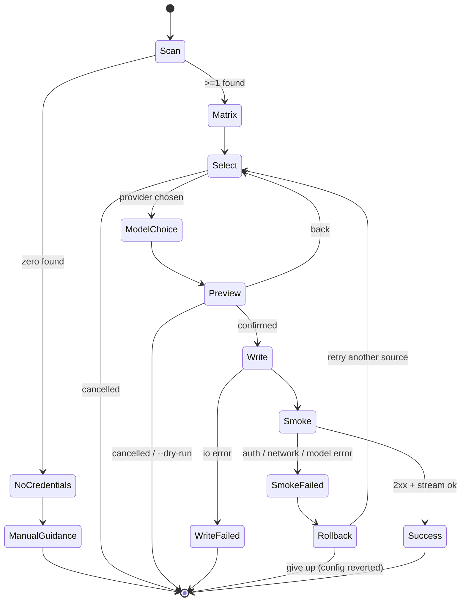

# `/connect` — Connectors flow

> **Status:** spec (v1) · **Owner:** dsh-bridge commands · **Surface:** slash command inside DSH
> **Related:** `/login`, `/model`, `/init` · **Reference:** DSH LLM adapter guide (`docs/user/develop/practice/llm-adapter.md` in the harness repo)

---

## 1. Purpose

`/connect [provider]` is the guided onboarding path that turns "I have API keys somewhere on this machine" into "DSH is configured and verified against a working model route" — without the user ever hand-editing YAML, and without dsh-bridge ever reading a secret into the transcript.

It exists because the DeepSeek Harness configures models through `cordis.yml` / profile patches with `!!js process.env.X` indirection. That is powerful and unfamiliar. Users arriving from Claude Code, Codex, OpenCode, and Jcode expect a connectors screen: *detect → confirm → configure → verify*. `/connect` ports that muscle memory onto DSH-native seams.

**Three jobs, in order:**

1. **Detect** credentials that already exist locally (agent credential files + environment variables), and report them *masked*.
2. **Configure** a DSH model route (profile patch + adapter/provider/model triple) from the user's chosen provider, using env-var indirection so the secret is never copied into config.
3. **Verify** with a minimal smoke test (one short streamed completion) and print a success card that states exactly what changed on disk.

**Explicit non-goals.**

- Not a credential manager: `/connect` never writes, rotates, renews, refreshes, or deletes a credential file.
- Not an OAuth client: `/connect` does not perform browser OAuth for Anthropic/Google/OpenAI. It *reuses* tokens another tool already obtained, and only when they are non-expired. Interactive login stays with the vendor's own CLI.
- No network egress other than (a) the single smoke-test request to the selected provider endpoint and (b) an optional model-list request to that same endpoint.

---

## 2. User story

> **Priya** installed DSH twenty minutes ago. She has been using Claude Code daily for six months and ran Codex last week, so `~/.claude/.credentials.json` and `~/.codex/auth.json` both exist. She also has `OPENAI_API_KEY` exported in her shell profile from an older project.
>
> She types `/connect`. Within two seconds she sees a table: Claude Code OAuth token found (valid, expires in 4 days), Codex auth found, `OPENAI_API_KEY` present (`sk-proj-…7Qa`), Gemini not found. Nothing is printed in full; every value is masked to a recognizable prefix and last four characters.
>
> She picks **Anthropic (Claude Code credentials)**. `/connect` explains, in one paragraph, that it will add a route to profile `web` in `~/.dsh/profiles/web/cordis.patch.yml`, referencing the credential by environment indirection rather than embedding it, and shows the exact YAML diff it intends to write. She confirms.
>
> A spinner runs a smoke test: one 12-token completion against `claude-sonnet-4-6`. It returns in 900 ms. The success card prints the route id, provider, model, latency, the file that changed, and the two follow-ups (`/model` to switch, `/connect --verify` to re-check). Total elapsed: under a minute, zero YAML typed, zero secrets on screen.

**Secondary story.** *Marc* runs `/connect openai` in CI-adjacent conditions with no TTY. Detection finds `OPENAI_API_KEY`; because `--yes` was passed and exactly one candidate matched, `/connect` writes the route non-interactively, runs the smoke test, and exits `0` with a machine-readable summary.

---

## 3. Triggers

| Invocation | Behavior |
|---|---|
| `/connect` | Full interactive flow. Scan everything, present detection matrix, prompt for provider selection. |
| `/connect <provider>` | Skip provider selection. Scan only sources for that provider; if none found, fall through to manual-entry guidance for it. Valid: `anthropic`, `openai`, `gemini`, `deepseek`, `opencode`, `openrouter`, `custom`. |
| `/connect --verify` | Skip detection and configuration. Run the smoke test against every already-configured route in the active profile and print a health table. |
| `/connect --list` | Detection matrix only. No writes, no network, no prompts. Safe read-only audit. |
| `/connect --profile <name>` | Target a DSH profile other than the active one. Default: active profile, else `default`. |
| `/connect --yes` | Non-interactive. Requires an unambiguous single candidate (or an explicit `<provider>`), else exits `2` without writing. |
| `/connect --no-smoke` | Configure but skip the verification request. Success card is downgraded to "configured, unverified". |
| `/connect --dry-run` | Perform detection and render the intended diff; write nothing. Implies `--no-smoke`. |

**Ambient triggers.** `/init` onboarding offers `/connect` as its first step when no model route is configured. `/model` offers `/connect` when the selected route resolves to a provider with no credential. A failed agent turn with `LlmError` code `PROVIDER_AUTH_ERROR` surfaces a one-line hint: *Run `/connect anthropic` to re-check credentials.*

---

## 4. Detection matrix

Every source is read-only. Files are opened with the caller's own permissions; nothing is created and nothing is chmod'd. Sources are probed in the order listed and the first *valid* one per provider wins, with lower-ranked hits still shown in the matrix as alternates.

| # | Provider | Source | Path / variable | Kind | Shape probed | Masked display | Notes |
|---|---|---|---|---|---|---|---|
| 1 | Anthropic | Claude Code | `~/.claude/.credentials.json` | OAuth | `claudeAiOauth.accessToken`, `.refreshToken`, `.expiresAt` | `oauth · expires in {rel}` | On macOS the file may be absent because the token lives in Keychain (`Claude Code-credentials`); see §8 E3. Never invokes `security` without consent. |
| 2 | Anthropic | Environment | `ANTHROPIC_API_KEY` | API key | non-empty, `sk-ant-` prefix expected | `sk-ant-…{last4}` | Highest precedence for non-interactive runs. |
| 3 | Anthropic | Environment | `ANTHROPIC_AUTH_TOKEN`, `ANTHROPIC_BASE_URL` | API key + endpoint | non-empty | `tok-…{last4}` + host | Proxy/gateway setups (LiteLLM, Bedrock shims). Base URL is *not* secret and is shown in full. |
| 4 | OpenAI | Codex CLI | `~/.codex/auth.json` | OAuth or key | `tokens.access_token` / `OPENAI_API_KEY` member | `oauth · expires in {rel}` or `sk-…{last4}` | Codex stores either shape depending on login mode. |
| 5 | OpenAI | Environment | `OPENAI_API_KEY` | API key | `sk-` prefix | `sk-…{last4}` | |
| 6 | OpenAI | Environment | `OPENAI_BASE_URL` | endpoint | URL parses | full host | Not a secret. Marks route as OpenAI-compatible custom. |
| 7 | Google | Gemini CLI | `~/.gemini/oauth_creds.json` | OAuth | `access_token`, `refresh_token`, `expiry_date` | `oauth · expires in {rel}` | |
| 8 | Google | Environment | `GEMINI_API_KEY`, `GOOGLE_API_KEY` | API key | non-empty | `AIza…{last4}` | `GEMINI_API_KEY` wins on conflict. |
| 9 | Multi | OpenCode | `~/.local/share/opencode/auth.json` | map | object keyed by provider → `{type, key\|access}` | per-provider row | One file can yield Anthropic + OpenAI + others; each becomes its own matrix row tagged `via opencode`. |
| 10 | DeepSeek | Environment | `DEEPSEEK_API_KEY` | API key | `sk-` prefix | `sk-…{last4}` | First-class: DSH's native adapter (`@deepseek-ai/dsh-llm` DeepSeek adapter). |
| 11 | OpenRouter | Environment | `OPENROUTER_API_KEY` | API key | `sk-or-` prefix | `sk-or-…{last4}` | OpenAI-compatible route. |
| 12 | Any | DSH profile | `~/.dsh/profiles/<p>/cordis.patch.yml` | existing route | adapter ids + `provider`/`model` under agent config | route id + provider | Detects *already configured* so `/connect` can offer update-vs-add instead of duplicating. |
| 13 | Any | DSH env file | `~/.dsh/.env`, `./.env` (cwd) | API key | `KEY=value` lines matching known names | `…{last4}` | Parsed, never echoed. `./.env` only when cwd is a trusted project root. |

**Status vocabulary per row** (exactly one):

| Status | Meaning | Selectable |
|---|---|---|
| `found` | Source exists, shape valid, not expired. | yes |
| `expired` | OAuth token present but `expiresAt`/`expiry_date` is in the past. | no — offer vendor-CLI re-login hint |
| `malformed` | File exists but JSON parse or shape probe failed. | no — show path only, never contents |
| `unreadable` | Exists but `EACCES`/`EPERM`. | no — show `chmod`-free advice |
| `not found` | Absent. | no |
| `configured` | Already wired into the target profile. | yes (as "re-verify" or "replace") |

**Precedence rule.** Within a provider: explicit env API key (rows 2/5/8/10/11) > agent OAuth file (1/4/7) > OpenCode map (9) > dotenv (13). Rationale: an env var is the user's most recent, most deliberate act, and it is the only shape `/connect` can reference from config without ever touching the value.

---

## 5. Flow states



**State contracts.**

| State | Does | Must not | Exit |
|---|---|---|---|
| **Scan** | Stat + parse the 13 sources concurrently, ≤300 ms budget, ≤64 KiB read per file. | Make any network call. Follow symlinks outside `$HOME`. Read a file larger than the cap. | Matrix rows in memory, secrets held only as opaque handles. |
| **Matrix** | Render the detection table with masked values and statuses. | Print any full secret; print file *contents* for malformed rows. | User sees state of the world. |
| **Select** | Prompt for one selectable row. Pre-highlight the highest-precedence `found` row. | Auto-select without confirmation unless `--yes` + unambiguous. | A `(provider, source)` pair. |
| **ModelChoice** | Offer known-good default model for the provider; optionally call the provider's model-list endpoint if the adapter advertises `listModels()`. | Block the flow if listing fails — fall back to the typed default. | A model id. |
| **Preview** | Show the literal YAML fragment to be added and the target file path. Show env indirection (`!!js process.env.ANTHROPIC_API_KEY`), never a literal value. | Write anything. | Explicit confirm. |
| **Write** | Atomic write: read patch → merge route → write `*.tmp` → `fsync` → rename. Back up prior file to `cordis.patch.yml.bak-{ts}`. | Reformat unrelated YAML; drop comments; write world-readable files (mode `0600`). | Path + backup path. |
| **Smoke** | One request: system prompt `"reply with OK"`, ≤16 output tokens, 20 s timeout, adapter's `attributionHeaders()` merged, abort signal honored. | Send project files, history, or credentials to any endpoint other than the selected provider's. Retry more than once. | Latency + first text chunk. |
| **Rollback** | Restore the backup verbatim when the smoke test fails on a *newly added* route. | Roll back a route the user already had before this run. | Config identical to pre-run state. |
| **Success** | Print the success card. | Claim verification when `--no-smoke`. | Exit `0`. |

**Exit codes.** `0` success · `1` smoke test failed (config rolled back) · `2` ambiguous/insufficient input in `--yes` mode · `3` write failure · `4` no credentials found · `130` user cancelled.

---

## 6. Output mockups

### 6.1 Detection matrix (`/connect`, `/connect --list`)

```
  /connect · connectors

  Scanning standard credential locations…                              done in 118ms

  PROVIDER    SOURCE                              STATUS      DETAIL
  ─────────────────────────────────────────────────────────────────────────────
  anthropic   ~/.claude/.credentials.json         found       oauth · expires in 4d
  anthropic   $ANTHROPIC_API_KEY                  not found   —
  openai      ~/.codex/auth.json                  found       oauth · expires in 22h
  openai      $OPENAI_API_KEY                     found       sk-proj-…7Qa
  google      ~/.gemini/oauth_creds.json          expired     re-run: gemini auth login
  google      $GEMINI_API_KEY                     not found   —
  deepseek    $DEEPSEEK_API_KEY                   found       sk-…4f19
  anthropic   opencode auth.json                  found       key · sk-ant-…9Kd  (alternate)
  ─────────────────────────────────────────────────────────────────────────────
  profile: web        configured routes: none

  Values are masked. dsh-bridge never reads a secret into the transcript,
  and never copies one into configuration — routes reference env vars only.

  Select a provider to connect:
  ❯ anthropic   via ~/.claude/.credentials.json   (recommended)
    openai      via $OPENAI_API_KEY
    deepseek    via $DEEPSEEK_API_KEY
    custom      OpenAI-compatible endpoint…
    cancel
```

### 6.2 Preview / consent

```
  /connect · anthropic

  Model:    claude-sonnet-4-6            (change with ↑↓, or type an id)
  Profile:  web
  File:     ~/.dsh/profiles/web/cordis.patch.yml          (backup will be written)

  The following will be appended:

    - id: bridge-anthropic
      name: '@dsh-bridge/llm-anthropic'
      config:
        credential: !!js process.env.ANTHROPIC_OAUTH_TOKEN
        providers: [anthropic]

    # agent-loop.agents[main]
    provider: anthropic
    model: claude-sonnet-4-6

  Your token is NOT written to this file. The route reads it from the
  environment at load time, exactly as the harness's own adapters do.

  Source ~/.claude/.credentials.json is OAuth-only, so dsh-bridge will also
  add one line to ~/.dsh/.env (mode 0600, git-ignored) exporting the token
  for the harness process. Decline to configure a static API key instead.

  [w] write   [e] edit model   [b] back   [q] cancel
```

### 6.3 Smoke test

```
  Writing route…                                                       ok
  Backup: ~/.dsh/profiles/web/cordis.patch.yml.bak-20260825T194512Z

  Smoke test  anthropic/claude-sonnet-4-6
    ⠋ streaming…
```

### 6.4 Success card

```
  ╭───────────────────────────────────────────────────────────────────╮
  │  ✓  Connected · anthropic                                         │
  ├───────────────────────────────────────────────────────────────────┤
  │  route      bridge-anthropic                                      │
  │  provider   anthropic                                             │
  │  model      claude-sonnet-4-6                                     │
  │  source     ~/.claude/.credentials.json  (oauth, expires in 4d)   │
  │  profile    web                                                   │
  │                                                                   │
  │  smoke      ok · 912ms · 11 in / 3 out · finish=stop              │
  │                                                                   │
  │  changed    ~/.dsh/profiles/web/cordis.patch.yml   (+9 lines)     │
  │             ~/.dsh/.env                            (+1 line, 0600)│
  │  backup     …/cordis.patch.yml.bak-20260825T194512Z               │
  ╰───────────────────────────────────────────────────────────────────╯

  Next:  /model            switch models within this route
         /connect openai   add a second provider
         /connect --verify re-check every configured route

  Heads up: this OAuth token expires in 4 days. When it does, refresh it with
  Claude Code, then run /connect --verify. dsh-bridge will not refresh it for you.
```

### 6.5 Failure card (smoke test rejected)

```
  ╭───────────────────────────────────────────────────────────────────╮
  │  ✗  Smoke test failed · anthropic                                 │
  ├───────────────────────────────────────────────────────────────────┤
  │  error      PROVIDER_AUTH_ERROR (HTTP 401)                        │
  │  meaning    The provider rejected this credential.                │
  │  likely     OAuth token revoked, or scoped to a different org.    │
  │                                                                   │
  │  config     rolled back — nothing was left behind                 │
  ╰───────────────────────────────────────────────────────────────────╯

  Try:   claude /login              refresh the Claude Code token, then retry
         /connect anthropic         pick $ANTHROPIC_API_KEY instead
         /connect --list            re-scan without writing

  Response body is not shown; it can echo credential material.
```

### 6.6 Nothing found

```
  /connect · no credentials detected

  Checked 13 locations. None held a usable credential.

  Fastest path — export a key, then re-run /connect:

    export DEEPSEEK_API_KEY=…      # native harness adapter, no extra plugin
    export ANTHROPIC_API_KEY=…
    export OPENAI_API_KEY=…

  Or log in with a tool you already use, then re-run /connect:

    claude /login      writes ~/.claude/.credentials.json
    codex login        writes ~/.codex/auth.json
    gemini auth login  writes ~/.gemini/oauth_creds.json

  /connect custom      point at any OpenAI-compatible endpoint
```

### 6.7 `--verify` health table

```
  /connect --verify · profile web

  ROUTE               PROVIDER    MODEL                 RESULT
  ────────────────────────────────────────────────────────────────────
  bridge-anthropic    anthropic   claude-sonnet-4-6     ok · 884ms
  bridge-openai       openai      gpt-5.2               ok · 1.2s
  bridge-gemini       google      gemini-3-pro          fail · 401 auth
  ────────────────────────────────────────────────────────────────────
  2 ok · 1 failed        fix: /connect gemini
```

---

## 7. Security invariants

These are testable assertions, not aspirations. Each maps to an acceptance criterion in §9.

| ID | Invariant |
|---|---|
| **S1** | **No secret is ever rendered.** Every credential-derived string passes through `mask()` before reaching any output sink (TTY, log, transcript, error message, telemetry). `mask(s)` = `prefix(s) + "…" + last4(s)`, and for `len(s) < 12` it returns `"…"` with no characters revealed. |
| **S2** | **No secret enters configuration files.** Written YAML contains only `!!js process.env.NAME` indirection. A post-write scan greps the produced file for any detected credential substring (≥8 chars) and aborts + rolls back on a hit. |
| **S3** | **Read-only on credential sources.** `/connect` opens agent credential files `O_RDONLY`, never writes/renames/deletes/chmods them, and never invokes vendor CLIs to mutate them. |
| **S4** | **Egress allowlist.** The only outbound requests are to the host of the selected provider route (smoke test, optional model list). No analytics, no dsh-bridge servers, no crash reporting. The allowlist is derived at runtime from the chosen base URL and enforced at the fetch wrapper. |
| **S5** | **No credential material crosses providers.** A token detected for provider A is never sent to provider B's endpoint, including during model listing. |
| **S6** | **Secrets are opaque in memory.** Detected values are held behind a handle type whose `toString`/`inspect`/`toJSON` return `"[redacted]"`, so accidental interpolation or structured logging cannot leak them. Handles are zeroed after the smoke test. |
| **S7** | **Error bodies are suppressed.** Provider error responses are reduced to `{status, code}`; the raw body is never printed, because auth errors frequently echo the submitted key. |
| **S8** | **Least-privilege files.** Any file `/connect` creates or rewrites (`~/.dsh/.env`, profile patch, backups) is mode `0600`. `~/.dsh/.env` is added to `~/.dsh/.gitignore` if that repo is git-tracked. |
| **S9** | **No implicit keychain access.** On macOS, reading `security find-generic-password` requires an explicit, separately-confirmed prompt each run; it is never silent, never cached, never the default. |
| **S10** | **Explicit consent before every write.** Interactive runs require an affirmative keypress after seeing the exact diff. `--yes` is the only bypass and must be user-supplied. |
| **S11** | **Atomic + reversible.** Writes are tmp+rename with a timestamped backup; any failure in Write or Smoke restores the pre-run bytes exactly. |
| **S12** | **No symlink escape.** Each source path is resolved and rejected if the realpath leaves `$HOME` (or the explicit `--profile` root), defeating symlink-bait attacks that would coax `/connect` into reading `/etc/shadow`-style targets. |
| **S13** | **Bounded reads.** Any credential file over 64 KiB is reported `malformed` and not parsed, capping parser-based DoS. |
| **S14** | **No transcript persistence of raw values.** Masked strings only in session history; the smoke-test request/response bodies are never stored in session storage. |

---

## 8. Edge cases

| ID | Case | Required behavior |
|---|---|---|
| **E1** | Both `~/.claude/.credentials.json` and `ANTHROPIC_API_KEY` present, different accounts. | Show both rows; env wins the pre-highlight per §4 precedence; the card names the chosen source explicitly so the user can catch a wrong-account pick. |
| **E2** | Claude OAuth token expires in < 24 h. | Status `found`, detail annotated `expires in 22h`; success card carries the expiry warning and the refresh instruction. Never auto-refresh. |
| **E3** | macOS with no `~/.claude/.credentials.json` (token in Keychain). | Row status `not found`, detail `keychain (macOS) — press k to read with your approval`. Reading requires S9 consent and may raise a system dialog; declining is a no-op. |
| **E4** | `~/.codex/auth.json` has `tokens.access_token` *and* a static `OPENAI_API_KEY` member. | Two alternate rows from one file; prefer the static key (no expiry management). |
| **E5** | OpenCode `auth.json` holds five providers. | Five rows tagged `via opencode`; each independently selectable. Malformed entries degrade individually, never failing the whole file. |
| **E6** | Credential file is `0644` and group-readable. | Configure normally, but append a non-blocking advisory to the success card: `~/.codex/auth.json is group-readable`. Do not chmod the user's file (S3). |
| **E7** | JSON is truncated or has a BOM/trailing comma. | `malformed`; print path + parse-error *kind* only (e.g. "unexpected end of input at byte 812"), never a content excerpt. |
| **E8** | `EACCES` on a path (e.g. root-owned home artifacts). | `unreadable`; suggest running as the owning user. No `sudo` suggestion, ever. |
| **E9** | Value looks structurally wrong (`ANTHROPIC_API_KEY="your-key-here"`, or a placeholder shorter than 12 chars). | `malformed`, detail `placeholder-like value`. Prevents a confusing 401 later. |
| **E10** | Route already exists for the chosen provider. | Offer `[u] update model  [r] replace credential source  [k] keep & verify only  [q] cancel`. Never silently duplicate a route id; append `-2` only on explicit replace-as-new. |
| **E11** | Profile patch has unresolvable YAML (user hand-edit broke it). | Refuse to write; show the parse error location; offer `/connect --profile <other>`. Do not "fix" or reformat the user's file. |
| **E12** | Smoke test times out (20 s) rather than erroring. | Treat as failure, roll back, but distinguish in the card: `network timeout — provider unreachable`, and suggest `--no-smoke` for offline/air-gapped configuration. |
| **E13** | Smoke test returns 200 but the stream yields no `text-delta` before `finish`. | Failure with code `EMPTY_STREAM`; usually a model id typo or a gateway that swallows content. Roll back. |
| **E14** | Provider returns 429 on the smoke test. | Not an auth failure: keep the config, mark the card `configured · rate-limited, unverified`, exit `0` with a warning. Retry once after 2 s before concluding. |
| **E15** | Non-TTY / piped stdin without `--yes`. | Exit `2` with the detection matrix printed as plain text (no ANSI, no spinners) and the exact `--yes` command line to re-run. |
| **E16** | Custom OpenAI-compatible endpoint over plain `http://` to a non-loopback host. | Require an extra explicit confirmation naming the risk (credential sent in cleartext). Loopback `http://` is allowed without the extra prompt. |
| **E17** | `ANTHROPIC_BASE_URL` set to a third-party gateway. | Route uses the gateway host; egress allowlist (S4) is derived from it; success card shows the host prominently so a hijacked base URL is visible. |
| **E18** | Two env vars for one provider disagree (`GEMINI_API_KEY` vs `GOOGLE_API_KEY`). | Show both; `GEMINI_API_KEY` pre-highlighted; card records which was used. |
| **E19** | `$HOME` unset or not writable. | Exit `3` early with a clear message; do not fall back to `/tmp` for config. |
| **E20** | User cancels mid-`Write` (SIGINT). | Signal handler completes or reverts the atomic rename; the process never exits with a half-written patch. Exit `130`. |
| **E21** | Detected credential also appears in the repo working tree (e.g. committed `.env`). | Flag it in the card as a security advisory with the file path (not the value) and recommend rotation. Still allows configuration. |
| **E22** | Adapter plugin for the chosen provider is not installed. | Detect before Write; offer to run the install step first (`dsh plugin --profile <p> add …`) and re-enter Preview afterward; never write a route pointing at a missing adapter. |

---

## 9. Acceptance criteria

**Detection**

- **A1** — Given all 13 sources absent, `/connect` exits `4`, prints the §6.6 guidance, and creates zero files.
- **A2** — Given a fixture HOME containing valid Claude, Codex, Gemini, and OpenCode credentials, `/connect --list` renders one row per discovered credential (OpenCode expanded per provider), each with a status from §4, and terminates without network activity (asserted by a fetch spy) and without writes (asserted by a filesystem snapshot hash).
- **A3** — An OAuth file whose `expiresAt` is in the past renders `expired` and is not selectable.
- **A4** — A 100 KiB `auth.json` renders `malformed` and the parser is never invoked (S13).
- **A5** — A symlink at `~/.codex/auth.json` pointing to `/etc/passwd` is refused with a symlink-escape message and no read (S12).

**Masking / secrecy**

- **A6** — Property test: for 10 000 random credential-shaped strings, no full value appears in captured stdout, stderr, session transcript, or written files (S1, S2).
- **A7** — A 9-character key renders as `…` with zero characters disclosed.
- **A8** — `JSON.stringify(secretHandle)`, template interpolation, and `console.log` of the handle all produce `[redacted]` (S6).
- **A9** — Post-write scan: injecting a route whose value accidentally contains the literal secret triggers abort + rollback, and the file on disk is byte-identical to the backup (S2, S11).

**Configuration**

- **A10** — After a successful `/connect anthropic --yes`, `~/.dsh/profiles/<p>/cordis.patch.yml` parses as valid YAML, contains the new route, retains every pre-existing key *and comment* byte-for-byte outside the inserted block, and is mode `0600`.
- **A11** — A timestamped `.bak-*` backup exists and matches the pre-run file hash.
- **A12** — `--dry-run` produces the identical rendered diff to a real run and leaves the filesystem snapshot hash unchanged.
- **A13** — Re-running `/connect anthropic --yes` is idempotent: it updates in place (E10 `keep & verify`) rather than creating `bridge-anthropic-2`.
- **A14** — Choosing a provider with no installed adapter blocks the write and offers installation (E22).

**Verification**

- **A15** — Smoke test issues exactly one request (plus at most one 429 retry), to the selected provider's host only, with `attributionHeaders()` merged and `signal` forwarded.
- **A16** — A 401 response yields exit `1`, the §6.5 card, and a filesystem identical to pre-run; the response body never appears in output (S7).
- **A17** — A 200 response with no `text-delta` yields `EMPTY_STREAM` and rollback (E13).
- **A18** — A 429 keeps the config, exits `0`, and labels the card `unverified` (E14).
- **A19** — `--no-smoke` prints `configured, unverified` and makes zero network requests.
- **A20** — `/connect --verify` on a profile with three routes performs exactly three requests and prints the §6.7 table without modifying config.

**Ergonomics / robustness**

- **A21** — Cold-run detection completes in ≤300 ms on a warm filesystem with all 13 sources present (measured p95 over 20 runs).
- **A22** — Non-TTY without `--yes` exits `2`, emits ANSI-free output, and prints a copy-pasteable `--yes` command.
- **A23** — SIGINT during Write leaves either the original file or the complete new file, never a partial one, across 100 randomized interrupt timings (E20).
- **A24** — Every failure path prints at least one concrete next action (a command the user can run), verified by asserting each error card template contains a `Try:`/`fix:` block.
- **A25** — Full flow (invoke → success card) is achievable in ≤5 keystrokes when exactly one credential is detected.
